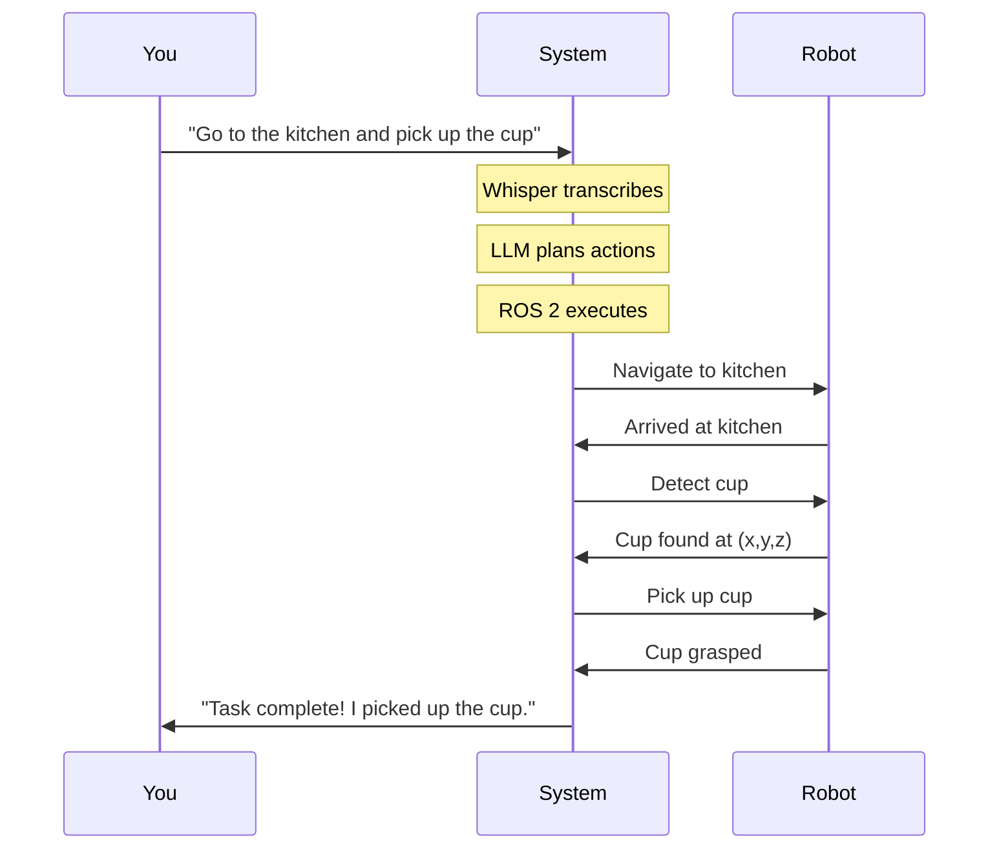
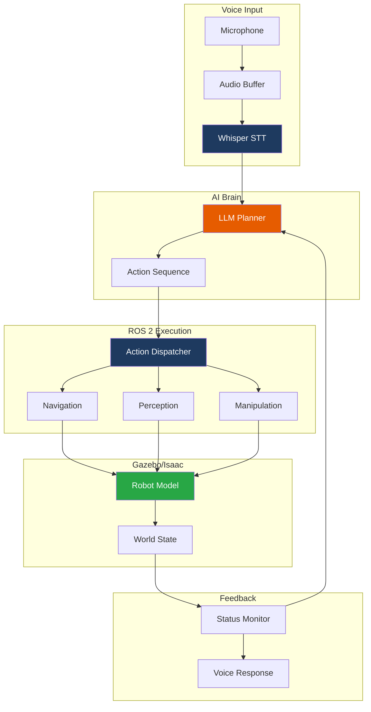

# Capstone Project: Voice-to-Action Humanoid System

Congratulations on reaching the capstone! 🎉 In this project, you'll integrate everything you've learned to build a complete Voice-to-Action humanoid robot system.

## Project Overview

Build a system where you speak a command, and a simulated humanoid robot executes it:



## Learning Objectives

By completing this capstone, you will demonstrate:

- ✅ End-to-end system integration skills
- ✅ Voice interface implementation
- ✅ LLM-based task planning
- ✅ ROS 2 action orchestration
- ✅ Simulation-based testing
- ✅ Error handling and recovery

## Estimated Time: 4 Hours

| Phase | Duration | Focus |
|-------|----------|-------|
| Setup | 30 min | Environment preparation |
| Integration | 90 min | Connect all components |
| Testing | 60 min | Verify pipeline |
| Demo | 30 min | Record demonstration |
| Polish | 30 min | Error handling |

## Prerequisites

Before starting, ensure you have completed:

- ✅ **Module 1**: ROS 2 Fundamentals
- ✅ **Module 2**: Gazebo Simulation
- ✅ **Module 3**: Isaac Sim (or Gazebo Nav2)
- ✅ **Module 4**: VLA Pipeline

## System Architecture



## Milestones

### Milestone 1: Environment Setup ✅
- [ ] Launch simulation world
- [ ] Spawn humanoid robot
- [ ] Verify ROS 2 topics active

### Milestone 2: Voice Pipeline ✅
- [ ] Whisper receiving audio
- [ ] Transcription working
- [ ] LLM generating action plans

### Milestone 3: Action Execution ✅
- [ ] Navigation to waypoints
- [ ] Object detection working
- [ ] Manipulation actions executing

### Milestone 4: Integration ✅
- [ ] End-to-end voice command works
- [ ] Feedback provided to user
- [ ] Error recovery functional

## Demo Commands

Test your system with these commands:

| Command | Expected Behavior |
|---------|-------------------|
| "Wave hello" | Robot waves arm |
| "Go to the table" | Robot navigates to table |
| "What do you see?" | Robot describes objects |
| "Pick up the red cup" | Robot grasps cup |
| "Put the cup on the shelf" | Robot places cup |

## Success Criteria

Your capstone is complete when:

1. **Voice Input**: Whisper transcribes commands accurately
2. **Planning**: LLM generates valid action sequences
3. **Execution**: Robot performs at least 3 different actions
4. **Feedback**: System reports task completion/failure
5. **Demo**: You can demonstrate the full pipeline

## Project Structure

```text
capstone_ws/
├── src/
│   ├── voice_interface/
│   │   ├── whisper_node.py
│   │   └── audio_capture.py
│   ├── ai_brain/
│   │   ├── llm_planner.py
│   │   └── action_schemas.py
│   ├── execution/
│   │   ├── action_dispatcher.py
│   │   ├── navigation_client.py
│   │   └── manipulation_client.py
│   └── capstone_bringup/
│       ├── launch/
│       │   └── capstone.launch.py
│       └── config/
│           └── robot_config.yaml
├── worlds/
│   └── capstone_world.sdf
└── README.md
```

## Getting Started

Ready to build your capstone?

**[Start Integration →](./integration)**

## Chapter Overview

| Chapter | Description |
|---------|-------------|
| [Integration](./integration) | Connect all components |
| [Testing](./testing) | Verify each stage |
| [Deployment](./deployment) | Run the full system |
| [Demo Scripts](./demo-scripts) | Pre-built demo commands |

---

**Capstone Progress:** 0/4 chapters completed

:::tip Portfolio Project
This capstone makes an excellent portfolio piece! Record a video demonstration to showcase your Physical AI skills.
:::
