# Learning Path

This page provides a visual overview of your learning journey through Physical AI and humanoid robotics. Follow the path from ROS 2 fundamentals to building a complete Voice-to-Action system.

## The Journey

```mermaid
flowchart TD
    subgraph FOUNDATION["🔧 Foundation"]
        A[Prerequisites Check] --> B[Module 1: ROS 2 Fundamentals]
    end

    subgraph SIMULATION["🎮 Simulation"]
        B --> C[Module 2: Gazebo]
        C --> D[Module 3: Isaac Sim]
    end

    subgraph INTELLIGENCE["🧠 Intelligence"]
        D --> E[Module 4: VLA & AI Brain]
    end

    subgraph DEPLOYMENT["🚀 Deployment"]
        E --> F[Module 5: Hardware]
        F --> G[Capstone Project]
    end

    G --> H((🏆 Physical AI Expert))

    style A fill:#6c757d,color:#fff
    style B fill:#1e3a5f,color:#fff
    style C fill:#1e3a5f,color:#fff
    style D fill:#1e3a5f,color:#fff
    style E fill:#e65c00,color:#fff
    style F fill:#1e3a5f,color:#fff
    style G fill:#28a745,color:#fff
    style H fill:#ffc107,color:#000
```

## Module Overview

### Module 1: ROS 2 Fundamentals ⏱️ 8-10 hours

The foundation of all modern robotics. Master the Robot Operating System 2.

**You'll Learn:**
- ROS 2 architecture and communication patterns
- Creating nodes, publishers, and subscribers
- Request/response with services
- Long-running tasks with actions
- URDF modeling for humanoid robots

**Outcome:** Build and run ROS 2 nodes that communicate via topics, services, and actions.

---

### Module 2: Digital Twins with Gazebo ⏱️ 6-8 hours

Create realistic physics simulations for testing robot behaviors.

**You'll Learn:**
- Gazebo Harmonic installation and configuration
- SDF world file creation
- Spawning URDF robots in simulation
- Physics parameter tuning
- Sensor plugins (camera, lidar, IMU)

**Outcome:** Run a humanoid robot in a custom Gazebo world with working sensors.

---

### Module 3: Isaac Sim & Navigation ⏱️ 6-8 hours

Photorealistic simulation and autonomous navigation.

**You'll Learn:**
- NVIDIA Isaac Sim installation (RTX required)
- Photorealistic rendering for perception training
- Isaac ROS package integration
- Visual SLAM for mapping
- Nav2 for bipedal locomotion

**Outcome:** Navigate a humanoid robot through a photorealistic environment using VSLAM and Nav2.

:::note RTX Required
Module 3 requires an NVIDIA RTX 3070+ GPU. Cloud GPU alternatives are provided for those without local hardware.
:::

---

### Module 4: VLA & AI Brain ⏱️ 8-10 hours

Give your robot intelligence with Vision-Language-Action models.

**You'll Learn:**
- Whisper integration for voice recognition
- LLM task planning (Claude/Llama)
- JSON action schemas
- ROS 2 action execution
- Error handling and recovery

**Outcome:** Build a pipeline that converts voice commands into robot actions.

---

### Module 5: Hardware & Deployment ⏱️ 4-6 hours

Deploy your software to real hardware.

**You'll Learn:**
- Workstation requirements for development
- Jetson Orin setup and ROS 2 deployment
- RealSense camera integration
- IMU and microphone setup
- Whisper optimization for edge

**Outcome:** Run your ROS 2 VLA pipeline on a Jetson edge device.

---

### Capstone Project ⏱️ 4 hours

Integrate everything into a complete Voice-to-Action system.

**You'll Build:**
1. Voice capture and transcription
2. LLM action planning
3. ROS 2 action dispatch
4. Navigation to target
5. Object manipulation
6. Status feedback

**Outcome:** A working demonstration of a voice-controlled humanoid robot in simulation.

---

## Recommended Study Plan

### Intensive Track (2 weeks)

| Week | Focus | Daily Commitment |
|------|-------|------------------|
| 1 | Modules 1-3 | 4-5 hours |
| 2 | Modules 4-5 + Capstone | 4-5 hours |

### Standard Track (4 weeks)

| Week | Focus | Daily Commitment |
|------|-------|------------------|
| 1 | Module 1: ROS 2 | 2-3 hours |
| 2 | Module 2: Gazebo | 2-3 hours |
| 3 | Modules 3-4: Isaac + VLA | 2-3 hours |
| 4 | Module 5 + Capstone | 2-3 hours |

### Weekend Warrior (8 weeks)

| Weekend | Focus |
|---------|-------|
| 1-2 | Module 1: ROS 2 |
| 3-4 | Module 2: Gazebo |
| 5 | Module 3: Isaac Sim |
| 6 | Module 4: VLA |
| 7 | Module 5: Hardware |
| 8 | Capstone Project |

## Skills Matrix

Track your progress across key competencies:

| Skill | Module | Level |
|-------|--------|-------|
| ROS 2 Nodes | 1 | Beginner → Intermediate |
| ROS 2 Communication | 1 | Beginner → Intermediate |
| URDF Modeling | 1 | Beginner |
| Gazebo Simulation | 2 | Beginner → Intermediate |
| Physics Tuning | 2 | Beginner |
| Isaac Sim | 3 | Beginner |
| VSLAM | 3 | Beginner |
| Nav2 | 3 | Beginner → Intermediate |
| Voice Recognition | 4 | Beginner |
| LLM Integration | 4 | Beginner → Intermediate |
| VLA Pipeline | 4 | Intermediate |
| Edge Deployment | 5 | Beginner |
| System Integration | Capstone | Intermediate |

## Ready to Start?

  

    <a href="./module-1-ros2/intro" className="button button--primary button--lg button--block">
      Start Module 1: ROS 2 →
    </a>
  

  

    <a href="./prerequisites" className="button button--secondary button--lg button--block">
      ← Back to Prerequisites
    </a>
  

---

**Estimated Total Time**: 40-50 hours
