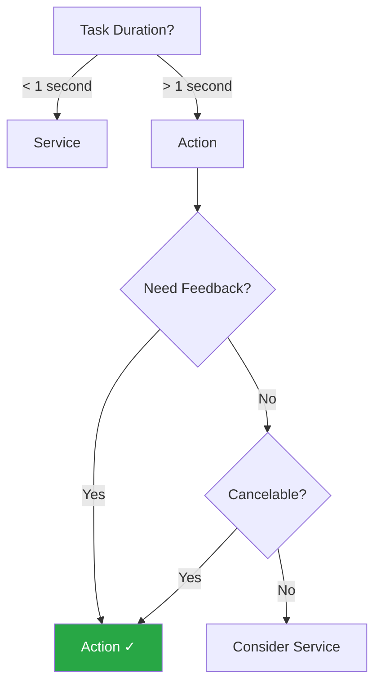
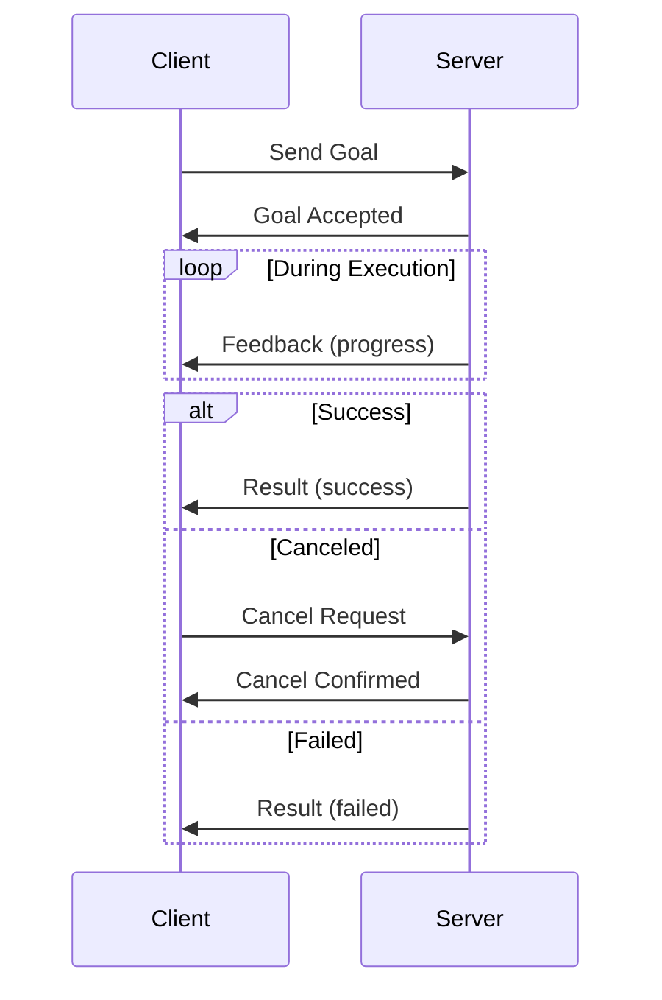
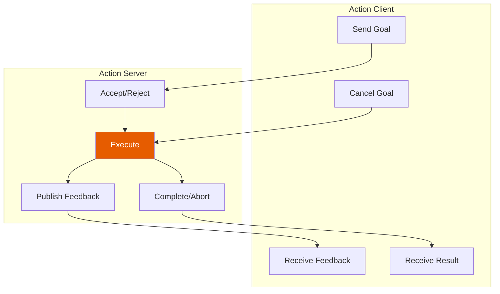
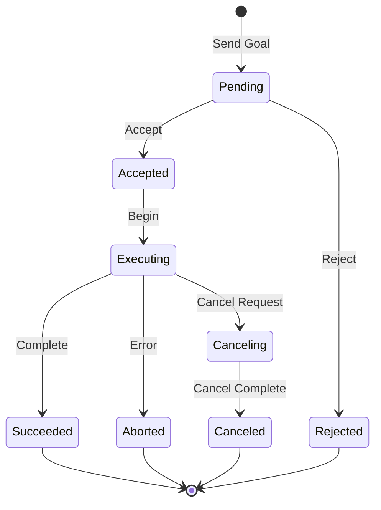

# Actions: Long-Running Tasks with Feedback

Actions handle tasks that take time to complete, providing continuous feedback and the ability to cancel mid-execution.

## Learning Objectives

- Understand the action protocol
- Create action servers
- Build action clients
- Handle goals, feedback, and results

## When to Use Actions



| Use Actions For | Examples |
|-----------------|----------|
| Navigation | Move robot to goal position |
| Manipulation | Pick and place objects |
| Motion execution | Execute trajectory |
| Calibration | Multi-step calibration routines |

## Action Components



## Using a Standard Action

Let's use the `Fibonacci` action from `example_interfaces`:

### Action Server

```python title="hello_ros2/fibonacci_server.py"
import time
import rclpy
from rclpy.action import ActionServer, GoalResponse, CancelResponse
from rclpy.node import Node
from example_interfaces.action import Fibonacci


class FibonacciServer(Node):
    """Action server that computes Fibonacci sequences."""

    def __init__(self):
        super().__init__('fibonacci_server')

        self._action_server = ActionServer(
            self,
            Fibonacci,
            'fibonacci',
            execute_callback=self.execute_callback,
            goal_callback=self.goal_callback,
            cancel_callback=self.cancel_callback
        )

        self.get_logger().info('Fibonacci Action Server ready')

    def goal_callback(self, goal_request):
        """Accept or reject incoming goal."""
        self.get_logger().info(f'Received goal: order={goal_request.order}')

        if goal_request.order < 0:
            self.get_logger().warn('Rejecting negative order')
            return GoalResponse.REJECT

        return GoalResponse.ACCEPT

    def cancel_callback(self, goal_handle):
        """Accept or reject cancel request."""
        self.get_logger().info('Received cancel request')
        return CancelResponse.ACCEPT

    async def execute_callback(self, goal_handle):
        """Execute the goal."""
        self.get_logger().info('Executing goal...')

        # Initialize Fibonacci sequence
        sequence = [0, 1]

        # Create feedback message
        feedback_msg = Fibonacci.Feedback()

        # Compute Fibonacci sequence
        for i in range(1, goal_handle.request.order):
            # Check for cancel
            if goal_handle.is_cancel_requested:
                goal_handle.canceled()
                self.get_logger().info('Goal canceled')
                result = Fibonacci.Result()
                result.sequence = sequence
                return result

            # Compute next number
            sequence.append(sequence[i] + sequence[i - 1])

            # Send feedback
            feedback_msg.partial_sequence = sequence
            goal_handle.publish_feedback(feedback_msg)
            self.get_logger().info(f'Feedback: {sequence}')

            # Simulate work
            time.sleep(0.5)

        # Mark goal as succeeded
        goal_handle.succeed()

        # Return result
        result = Fibonacci.Result()
        result.sequence = sequence
        self.get_logger().info(f'Result: {sequence}')
        return result


def main(args=None):
    rclpy.init(args=args)
    node = FibonacciServer()

    try:
        rclpy.spin(node)
    except KeyboardInterrupt:
        pass
    finally:
        node.destroy_node()
        rclpy.shutdown()


if __name__ == '__main__':
    main()
```

### Action Client

```python title="hello_ros2/fibonacci_client.py"
import rclpy
from rclpy.action import ActionClient
from rclpy.node import Node
from example_interfaces.action import Fibonacci


class FibonacciClient(Node):
    """Action client that requests Fibonacci sequences."""

    def __init__(self):
        super().__init__('fibonacci_client')

        self._action_client = ActionClient(
            self,
            Fibonacci,
            'fibonacci'
        )

        self.get_logger().info('Fibonacci Client ready')

    def send_goal(self, order):
        """Send goal and wait for result."""
        goal_msg = Fibonacci.Goal()
        goal_msg.order = order

        # Wait for server
        self._action_client.wait_for_server()

        # Send goal with feedback callback
        self._send_goal_future = self._action_client.send_goal_async(
            goal_msg,
            feedback_callback=self.feedback_callback
        )

        self._send_goal_future.add_done_callback(self.goal_response_callback)

    def goal_response_callback(self, future):
        """Handle goal acceptance/rejection."""
        goal_handle = future.result()

        if not goal_handle.accepted:
            self.get_logger().info('Goal rejected')
            return

        self.get_logger().info('Goal accepted')

        # Get result
        self._get_result_future = goal_handle.get_result_async()
        self._get_result_future.add_done_callback(self.get_result_callback)

    def feedback_callback(self, feedback_msg):
        """Handle feedback during execution."""
        feedback = feedback_msg.feedback
        self.get_logger().info(
            f'Feedback: {feedback.partial_sequence}'
        )

    def get_result_callback(self, future):
        """Handle final result."""
        result = future.result().result
        self.get_logger().info(f'Result: {result.sequence}')
        rclpy.shutdown()


def main(args=None):
    rclpy.init(args=args)
    node = FibonacciClient()

    # Request Fibonacci sequence of order 10
    node.send_goal(10)

    rclpy.spin(node)


if __name__ == '__main__':
    main()
```

## Update Entry Points

```python title="Add to setup.py"
'fibonacci_server = hello_ros2.fibonacci_server:main',
'fibonacci_client = hello_ros2.fibonacci_client:main',
```

## Build and Run

```bash title="Build"
cd ~/ros2_ws
colcon build --packages-select hello_ros2
source install/setup.bash
```

### Terminal 1: Server

```bash
ros2 run hello_ros2 fibonacci_server
```

### Terminal 2: Client

```bash
ros2 run hello_ros2 fibonacci_client
```

**Expected output (client):**
```
[INFO] [fibonacci_client]: Fibonacci Client ready
[INFO] [fibonacci_client]: Goal accepted
[INFO] [fibonacci_client]: Feedback: [0, 1, 1]
[INFO] [fibonacci_client]: Feedback: [0, 1, 1, 2]
[INFO] [fibonacci_client]: Feedback: [0, 1, 1, 2, 3]
...
[INFO] [fibonacci_client]: Result: [0, 1, 1, 2, 3, 5, 8, 13, 21, 34, 55]
```

## Action from CLI

```bash title="Send goal from CLI"
ros2 action send_goal /fibonacci example_interfaces/action/Fibonacci "{order: 5}"
```

With feedback:

```bash title="With feedback"
ros2 action send_goal /fibonacci example_interfaces/action/Fibonacci "{order: 5}" --feedback
```

## Humanoid Robot Action Example

A more realistic navigation action:

```python title="Navigation action concept"
# Action definition would be:
# Goal: target_pose (geometry_msgs/Pose)
# Feedback: current_pose, distance_remaining
# Result: success, final_pose, message

class NavigationServer(Node):
    async def execute_callback(self, goal_handle):
        target = goal_handle.request.target_pose
        feedback = NavigateToPose.Feedback()

        while not self.reached_goal(target):
            if goal_handle.is_cancel_requested:
                goal_handle.canceled()
                return NavigateToPose.Result(success=False)

            # Move toward goal
            self.move_step(target)

            # Publish feedback
            feedback.current_pose = self.get_current_pose()
            feedback.distance_remaining = self.distance_to(target)
            goal_handle.publish_feedback(feedback)

        goal_handle.succeed()
        return NavigateToPose.Result(
            success=True,
            final_pose=self.get_current_pose()
        )
```

## Action Architecture



## Goal States



## Best Practices

### 1. Check for Cancellation

```python
async def execute_callback(self, goal_handle):
    for step in range(total_steps):
        if goal_handle.is_cancel_requested:
            goal_handle.canceled()
            return Result(success=False)
        # Do work...
```

### 2. Regular Feedback

```python
# Send feedback at consistent intervals
feedback_rate = 10  # Hz
while executing:
    # Do work...
    if time_for_feedback():
        goal_handle.publish_feedback(feedback)
```

### 3. Handle Preemption

```python
def goal_callback(self, goal_request):
    # Optionally reject if already executing
    if self.currently_executing:
        return GoalResponse.REJECT
    return GoalResponse.ACCEPT
```

## Exercise: Walk Action

Create an action server/client for a walking command:

**Goal**: Distance to walk (float)
**Feedback**: Distance traveled, steps taken
**Result**: Success, total steps

<details>
<summary>Click for Hint</summary>

Use `example_interfaces/action/Fibonacci` as a template, but track:
- `distance_remaining` in feedback
- `step_count` in feedback
- Loop until `distance_traveled >= goal.distance`

</details>

## Summary

You've learned to:
- ✅ Create action servers with goal/cancel/execute callbacks
- ✅ Build action clients with feedback handlers
- ✅ Send goals and receive results
- ✅ Handle cancellation gracefully
- ✅ Use actions from CLI

## Next Steps

Learn to model humanoid robots:

**[Continue to URDF Basics →](./urdf-basics)**
