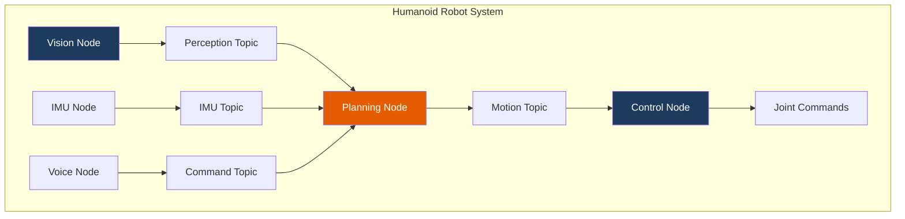
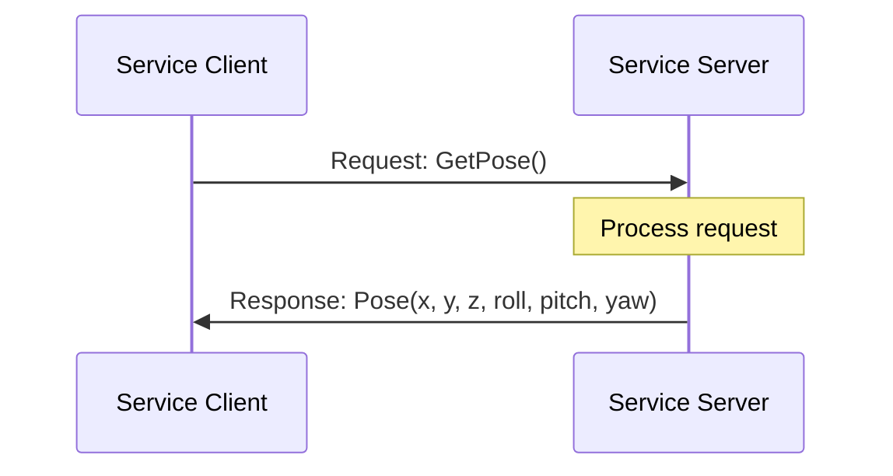
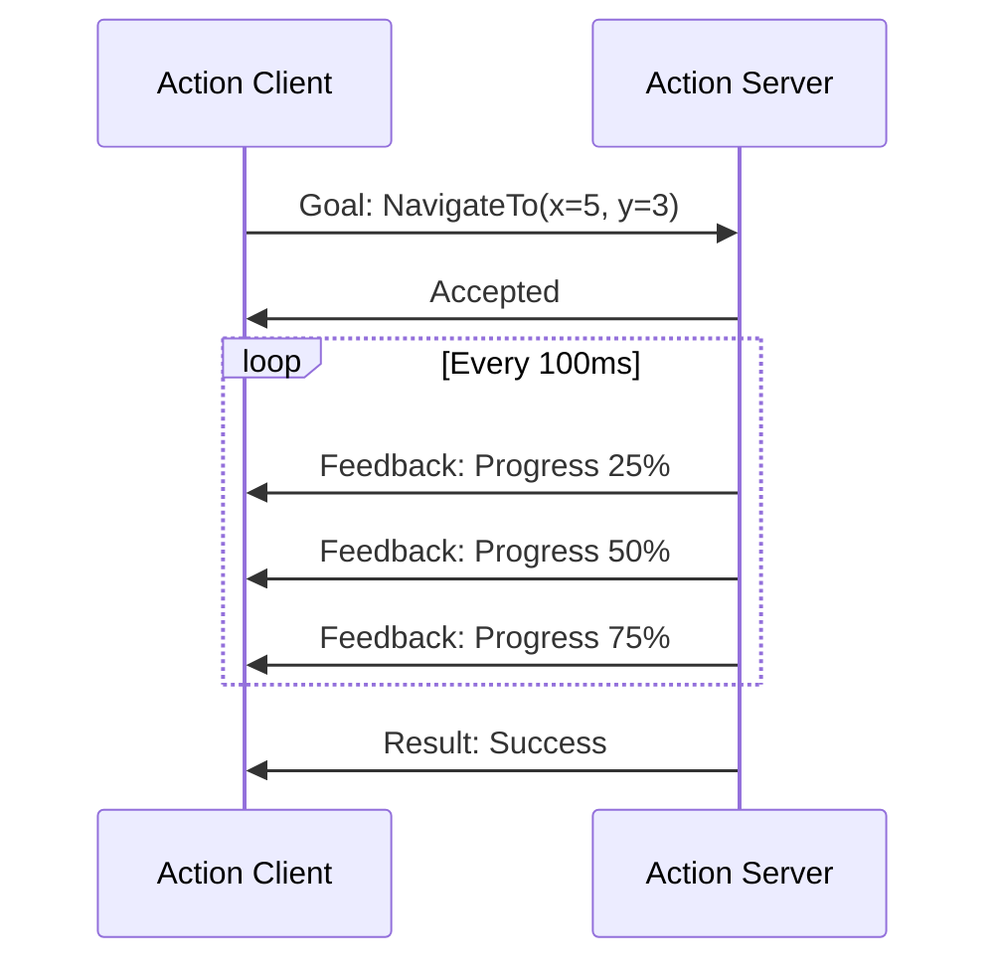
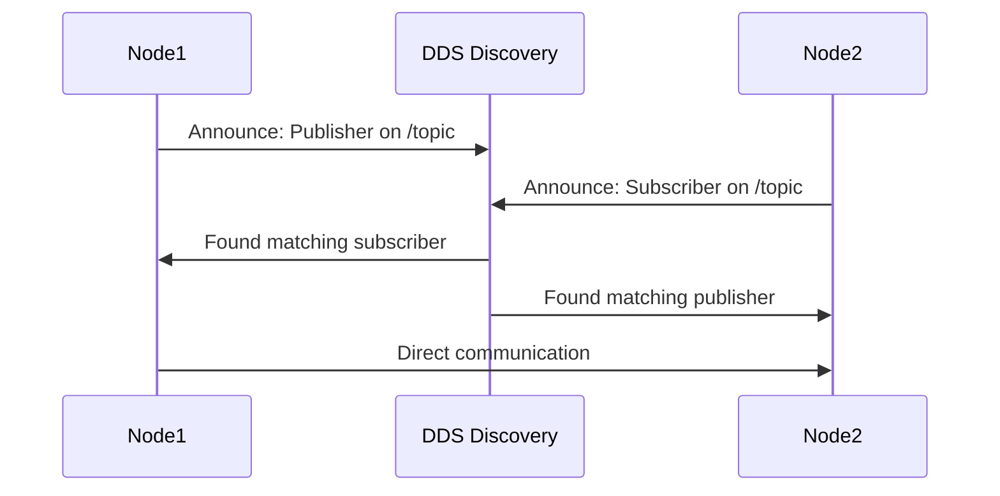

# ROS 2 Core Concepts

Before writing any code, let's understand the fundamental building blocks of ROS 2. These concepts form the foundation of all robotics applications built with ROS 2.

## Learning Objectives

- Understand the ROS 2 computation graph
- Learn the four communication patterns
- Know when to use each pattern
- Visualize ROS 2 architecture

## The Computation Graph

ROS 2 applications are built as a graph of interconnected nodes:



## Core Concepts

### 1. Nodes

A **node** is an independent process that performs computation. Think of nodes as specialized workers:

| Node Example | Responsibility |
|--------------|----------------|
| `camera_driver` | Read camera data |
| `object_detector` | Detect objects in images |
| `motion_planner` | Plan robot movements |
| `joint_controller` | Send commands to motors |

**Key Properties:**
- Nodes are modular and reusable
- Each node has a unique name
- Nodes can be distributed across machines
- Nodes can be written in Python (rclpy) or C++ (rclcpp)

### 2. Topics

**Topics** provide asynchronous, many-to-many communication:

```mermaid
graph LR
    subgraph Publishers
        A[Camera Node]
        B[Lidar Node]
    end

    subgraph Topic
        C[/sensor_data]
    end

    subgraph Subscribers
        D[Perception Node]
        E[Logger Node]
    end

    A --> C
    B --> C
    C --> D
    C --> E

    style C fill:#1e3a5f,color:#fff
```

**Characteristics:**
- Publishers send messages to a topic
- Subscribers receive messages from a topic
- No direct connection between publisher and subscriber
- Messages are typed (e.g., `sensor_msgs/Image`)

**Use Topics When:**
- ✅ Streaming continuous data (sensor readings)
- ✅ Broadcasting to multiple receivers
- ✅ Sender doesn't need acknowledgment

### 3. Services

**Services** provide synchronous request/response communication:



**Characteristics:**
- Client sends a request, waits for response
- Server processes requests one at a time
- Blocking call (client waits)

**Use Services When:**
- ✅ Need a response to proceed
- ✅ Infrequent operations (configuration, queries)
- ✅ Single request/response pattern

### 4. Actions

**Actions** handle long-running tasks with feedback:



**Characteristics:**
- Goals can be accepted or rejected
- Continuous feedback during execution
- Goals can be canceled mid-execution
- Non-blocking (client can do other work)

**Use Actions When:**
- ✅ Task takes significant time (navigation, manipulation)
- ✅ Need progress updates
- ✅ May need to cancel mid-execution

## Communication Comparison

| Feature | Topics | Services | Actions |
|---------|--------|----------|---------|
| Pattern | Pub/Sub | Request/Response | Goal/Feedback/Result |
| Blocking | No | Yes | No |
| Feedback | No | No | Yes |
| Cancelable | No | No | Yes |
| Use Case | Streaming | Queries | Long tasks |

## Message Types

ROS 2 uses typed messages. Common packages:

| Package | Examples |
|---------|----------|
| `std_msgs` | `String`, `Int32`, `Float64`, `Bool` |
| `geometry_msgs` | `Pose`, `Twist`, `Point`, `Quaternion` |
| `sensor_msgs` | `Image`, `LaserScan`, `Imu`, `JointState` |
| `nav_msgs` | `Odometry`, `Path`, `OccupancyGrid` |

## Humanoid Robot Example

Let's see how these concepts apply to a humanoid robot:

```mermaid
graph TB
    subgraph Sensors["Sensor Nodes"]
        A[Camera Driver]
        B[IMU Driver]
        C[Joint State Publisher]
    end

    subgraph Topics["Topics"]
        D[/camera/image_raw]
        E[/imu/data]
        F[/joint_states]
    end

    subgraph Processing["Processing Nodes"]
        G[Object Detector]
        H[Balance Controller]
        I[Motion Planner]
    end

    subgraph Services["Services"]
        J[/get_robot_state]
        K[/set_pose]
    end

    subgraph Actions["Actions"]
        L[/walk_to_goal]
        M[/pick_object]
    end

    A --> D --> G
    B --> E --> H
    C --> F --> H
    I --> J
    I --> K
    I --> L
    I --> M

    style D fill:#1e3a5f,color:#fff
    style J fill:#e65c00,color:#fff
    style L fill:#28a745,color:#fff
```

## Quality of Service (QoS)

ROS 2 introduces QoS policies for reliable communication:

| Policy | Options | Use Case |
|--------|---------|----------|
| **Reliability** | Reliable / Best Effort | Reliable for commands, Best Effort for sensors |
| **Durability** | Volatile / Transient Local | Transient for configuration |
| **History** | Keep Last / Keep All | Keep Last with depth for efficiency |
| **Depth** | 1-1000 | Small for real-time, larger for logging |

```python title="QoS Example"
from rclpy.qos import QoSProfile, ReliabilityPolicy

# Reliable QoS for commands
reliable_qos = QoSProfile(
    reliability=ReliabilityPolicy.RELIABLE,
    depth=10
)

# Best effort for sensors
sensor_qos = QoSProfile(
    reliability=ReliabilityPolicy.BEST_EFFORT,
    depth=1
)
```

## Namespaces and Remapping

Organize nodes with namespaces:

```bash
# Launch with namespace
ros2 run my_package my_node --ros-args -r __ns:=/robot1

# Topics become:
# /robot1/joint_states
# /robot1/cmd_vel
```

## Discovery

ROS 2 uses DDS for automatic discovery:



## Exercises

### Exercise 1: Identify the Pattern

For each scenario, identify the best communication pattern:

1. Streaming camera images at 30fps → **?**
2. Asking for the robot's current pose → **?**
3. Commanding the robot to walk to a location → **?**
4. Broadcasting joint positions continuously → **?**

<details>
<summary>Click for Answers</summary>

1. **Topic** - Continuous streaming, multiple subscribers
2. **Service** - Single request/response, need answer to proceed
3. **Action** - Long-running, need feedback, might cancel
4. **Topic** - Continuous broadcasting

</details>

### Exercise 2: Design a System

Design the communication architecture for a robot arm that:
- Reads joint positions from encoders
- Receives grasp commands
- Reports grasp progress
- Allows querying current position

<details>
<summary>Click for Solution</summary>

```mermaid
graph LR
    A[Encoder Driver] -->|Topic| B[/joint_states]
    C[Grasp Command] -->|Action| D[/grasp_object]
    D -->|Feedback| E[Progress %]
    F[Position Query] -->|Service| G[/get_position]
```

</details>

## Summary

| Concept | Purpose | Key Feature |
|---------|---------|-------------|
| **Nodes** | Modular computation | Independent processes |
| **Topics** | Data streaming | Pub/Sub pattern |
| **Services** | Queries | Request/Response |
| **Actions** | Long tasks | Goals with feedback |

## Next Steps

Now that you understand the concepts, let's set up your development environment:

**[Continue to Setup →](./setup)**
