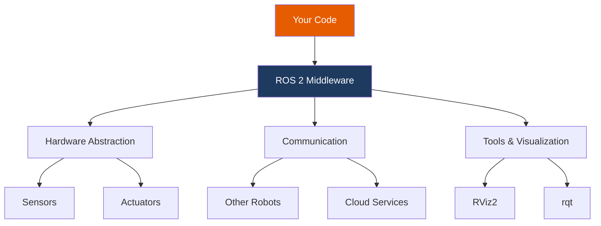
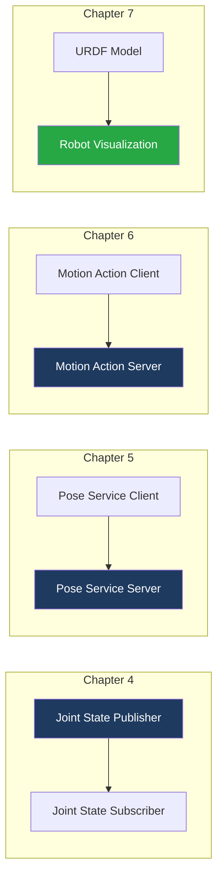

# Module 1: ROS 2 Fundamentals

Welcome to Module 1! In this module, you'll master the Robot Operating System 2 (ROS 2) - the industry-standard middleware powering robots from research labs to production deployments worldwide.

## Learning Objectives

By the end of this module, you will be able to:

- ✅ Understand ROS 2 architecture and core concepts
- ✅ Create and run ROS 2 nodes using Python (rclpy)
- ✅ Implement publisher/subscriber communication patterns
- ✅ Build request/response interactions with services
- ✅ Create long-running goal-based tasks with actions
- ✅ Model humanoid robots using URDF format

## Why ROS 2?



ROS 2 provides:

| Feature | Benefit |
|---------|---------|
| **Modularity** | Break complex systems into manageable nodes |
| **Communication** | Standard patterns for data exchange |
| **Hardware Abstraction** | Same code works on different robots |
| **Ecosystem** | Thousands of packages for perception, planning, control |
| **Industry Adoption** | Used by Boston Dynamics, NVIDIA, Amazon, and more |

## Module Structure

| Chapter | Topic | Duration |
|---------|-------|----------|
| 1 | [Core Concepts](./concepts) | 45 min |
| 2 | [Installation & Setup](./setup) | 30 min |
| 3 | [Hello ROS 2](./hello-ros2) | 45 min |
| 4 | [Publishers & Subscribers](./pubsub) | 60 min |
| 5 | [Services](./services) | 45 min |
| 6 | [Actions](./actions) | 60 min |
| 7 | [URDF Basics](./urdf-basics) | 90 min |
| 8 | [Troubleshooting](./troubleshooting) | Reference |

**Total Time: 8-10 hours**

## Prerequisites

Before starting this module, ensure you have:

- ✅ Ubuntu 22.04 (native or WSL2)
- ✅ Python 3.10+ installed
- ✅ Basic Python programming knowledge
- ✅ Familiarity with Linux command line

:::tip New to Linux?
If you're coming from Windows or macOS, spend 30 minutes reviewing basic Linux commands (`cd`, `ls`, `mkdir`, `nano`) before proceeding.
:::

## What You'll Build

Throughout this module, you'll progressively build components of a humanoid robot control system:



## Key Concepts Preview

### Nodes
Independent processes that perform computation. A humanoid robot might have nodes for:
- Joint control
- Balance management
- Vision processing
- Motion planning

### Topics
Asynchronous data streams using publish/subscribe pattern. Examples:
- `/joint_states` - Current joint positions
- `/imu/data` - Inertial measurement data
- `/camera/image_raw` - Camera images

### Services
Synchronous request/response communication. Examples:
- `/get_robot_state` - Query current pose
- `/set_joint_position` - Command specific position

### Actions
Long-running tasks with feedback and cancellation. Examples:
- `/walk_to_goal` - Navigate to a position
- `/pick_object` - Grasp an object

## Environment Setup Check

Before proceeding, verify your ROS 2 installation:

```bash title="Verify ROS 2 Humble"
source /opt/ros/humble/setup.bash
ros2 --version
```

**Expected output:**
```
ros2 0.10.x
```

If you see "command not found", complete the [Prerequisites](../prerequisites) setup first.

## Ready to Begin?

Let's start your ROS 2 journey:

**[Start Chapter 1: Core Concepts →](./concepts)**

---

**Module Progress:** 0/8 chapters completed
