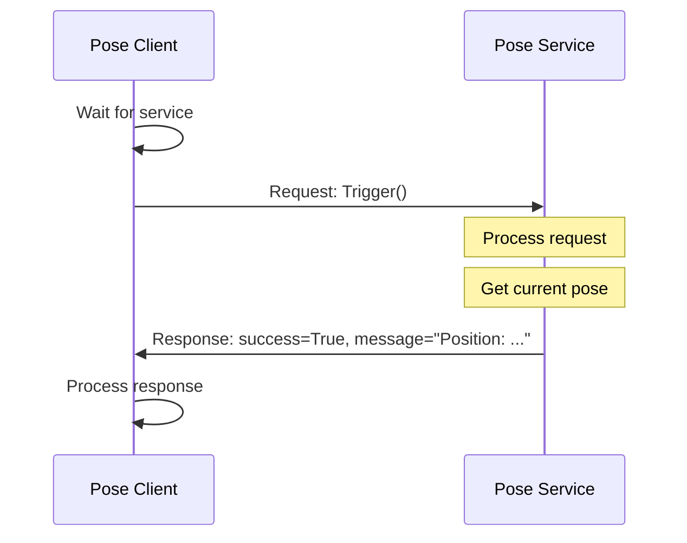

# Services: Request/Response Communication

Services provide synchronous request/response communication. Perfect for queries and configuration operations.

## Learning Objectives

- Create service servers and clients
- Define custom service types
- Handle service calls properly
- Know when to use services vs topics

## When to Use Services

| Use Services For | Don't Use Services For |
|------------------|------------------------|
| ✅ Configuration changes | ❌ Continuous data streams |
| ✅ State queries | ❌ High-frequency updates |
| ✅ One-time operations | ❌ Real-time control |
| ✅ Calibration requests | ❌ Sensor data |

## Service Server

Create a service that returns the robot's current pose:

```python title="hello_ros2/pose_service.py"
import rclpy
from rclpy.node import Node
from geometry_msgs.msg import Pose
from std_srvs.srv import Trigger
from example_interfaces.srv import SetBool


class PoseService(Node):
    """Service server that provides robot pose."""

    def __init__(self):
        super().__init__('pose_service')

        # Current pose (simulated)
        self.pose = Pose()
        self.pose.position.x = 1.0
        self.pose.position.y = 2.0
        self.pose.position.z = 0.0

        # Create service server
        self.srv = self.create_service(
            Trigger,                    # Service type
            '/get_robot_state',         # Service name
            self.get_state_callback     # Callback
        )

        # Service to enable/disable robot
        self.enable_srv = self.create_service(
            SetBool,
            '/enable_robot',
            self.enable_callback
        )

        self.enabled = False
        self.get_logger().info('Pose Service ready')

    def get_state_callback(self, request, response):
        """Handle get_robot_state requests."""
        self.get_logger().info('Received state request')

        response.success = True
        response.message = (
            f'Position: ({self.pose.position.x:.2f}, '
            f'{self.pose.position.y:.2f}, {self.pose.position.z:.2f})'
        )
        return response

    def enable_callback(self, request, response):
        """Handle enable_robot requests."""
        self.enabled = request.data

        if self.enabled:
            self.get_logger().info('Robot ENABLED')
            response.success = True
            response.message = 'Robot enabled successfully'
        else:
            self.get_logger().info('Robot DISABLED')
            response.success = True
            response.message = 'Robot disabled successfully'

        return response


def main(args=None):
    rclpy.init(args=args)
    node = PoseService()

    try:
        rclpy.spin(node)
    except KeyboardInterrupt:
        pass
    finally:
        node.destroy_node()
        rclpy.shutdown()


if __name__ == '__main__':
    main()
```

## Service Client

Create a client that calls the service:

```python title="hello_ros2/pose_client.py"
import rclpy
from rclpy.node import Node
from std_srvs.srv import Trigger


class PoseClient(Node):
    """Service client that queries robot pose."""

    def __init__(self):
        super().__init__('pose_client')

        # Create service client
        self.client = self.create_client(
            Trigger,
            '/get_robot_state'
        )

        # Wait for service to be available
        while not self.client.wait_for_service(timeout_sec=1.0):
            self.get_logger().info('Waiting for service...')

        self.get_logger().info('Service available!')

    def send_request(self):
        """Send request and wait for response."""
        request = Trigger.Request()

        # Call service asynchronously
        future = self.client.call_async(request)

        # Wait for response
        rclpy.spin_until_future_complete(self, future)

        return future.result()


def main(args=None):
    rclpy.init(args=args)
    node = PoseClient()

    # Send request
    response = node.send_request()

    if response.success:
        node.get_logger().info(f'Success: {response.message}')
    else:
        node.get_logger().error(f'Failed: {response.message}')

    node.destroy_node()
    rclpy.shutdown()


if __name__ == '__main__':
    main()
```

## Update Entry Points

```python title="setup.py entry_points (add these)"
'pose_service = hello_ros2.pose_service:main',
'pose_client = hello_ros2.pose_client:main',
```

## Build and Run

```bash title="Build and run"
cd ~/ros2_ws
colcon build --packages-select hello_ros2
source install/setup.bash
```

### Terminal 1: Server

```bash
ros2 run hello_ros2 pose_service
```

### Terminal 2: Client

```bash
ros2 run hello_ros2 pose_client
```

**Expected output:**
```
[INFO] [pose_client]: Service available!
[INFO] [pose_client]: Success: Position: (1.00, 2.00, 0.00)
```

## Call Service from CLI

```bash title="Call service from command line"
ros2 service call /get_robot_state std_srvs/srv/Trigger
```

**Output:**
```
waiting for service to become available...
requester: making request: std_srvs.srv.Trigger_Request()

response:
std_srvs.srv.Trigger_Response(success=True, message='Position: (1.00, 2.00, 0.00)')
```

## Standard Service Types

| Service | Request | Response | Use Case |
|---------|---------|----------|----------|
| `std_srvs/Trigger` | Empty | success, message | Simple queries |
| `std_srvs/SetBool` | data (bool) | success, message | Enable/disable |
| `std_srvs/Empty` | Empty | Empty | Reset, clear |

## Custom Service Definition

For complex operations, create custom services:

```text title="srv/GetPose.srv"
# Request
string frame_id
---
# Response
geometry_msgs/Pose pose
bool success
string message
```

Create in your package:

```bash
mkdir -p ~/ros2_ws/src/hello_ros2/srv
```

Update `package.xml`:

```xml
<build_depend>rosidl_default_generators</build_depend>
<exec_depend>rosidl_default_runtime</exec_depend>
<member_of_group>rosidl_interface_packages</member_of_group>
```

Update `CMakeLists.txt` (if using ament_cmake) or create an interface package.

## Service Architecture



## Async Client Pattern

For non-blocking service calls:

```python title="Async service client"
class AsyncPoseClient(Node):
    def __init__(self):
        super().__init__('async_pose_client')
        self.client = self.create_client(Trigger, '/get_robot_state')

        # Timer to periodically check pose
        self.timer = self.create_timer(5.0, self.timer_callback)
        self.future = None

    def timer_callback(self):
        if self.future is None or self.future.done():
            # Send new request
            request = Trigger.Request()
            self.future = self.client.call_async(request)
            self.future.add_done_callback(self.response_callback)

    def response_callback(self, future):
        response = future.result()
        if response.success:
            self.get_logger().info(f'Pose: {response.message}')
```

## Error Handling

Always handle service unavailability:

```python title="Robust service client"
def send_request_safe(self):
    if not self.client.service_is_ready():
        self.get_logger().warn('Service not available')
        return None

    request = Trigger.Request()
    future = self.client.call_async(request)

    # Timeout after 5 seconds
    rclpy.spin_until_future_complete(self, future, timeout_sec=5.0)

    if future.done():
        return future.result()
    else:
        self.get_logger().error('Service call timed out')
        return None
```

## Exercise: Configuration Service

Create a service to configure robot parameters:

1. **Server**: Accept joint limits configuration
2. **Client**: Send new limits and verify response

Use `example_interfaces/srv/SetBool` or create a custom service.

<details>
<summary>Click for Hint</summary>

```python
# Server stores configuration
self.joint_limits = {'hip': 1.57, 'knee': 2.0}

# Callback updates and confirms
def config_callback(self, request, response):
    if request.data:  # Enable strict limits
        self.joint_limits = {'hip': 0.5, 'knee': 1.0}
        response.message = 'Strict limits enabled'
    else:
        self.joint_limits = {'hip': 1.57, 'knee': 2.0}
        response.message = 'Normal limits restored'
    response.success = True
    return response
```

</details>

## Summary

You've learned to:
- ✅ Create service servers with callbacks
- ✅ Create service clients (sync and async)
- ✅ Use standard service types
- ✅ Call services from CLI
- ✅ Handle errors gracefully

## Next Steps

Learn long-running tasks with feedback:

**[Continue to Actions →](./actions)**
