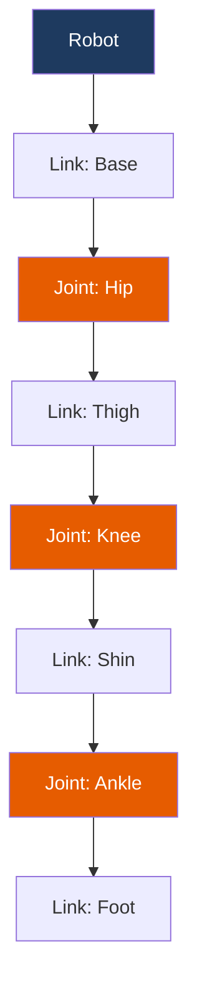
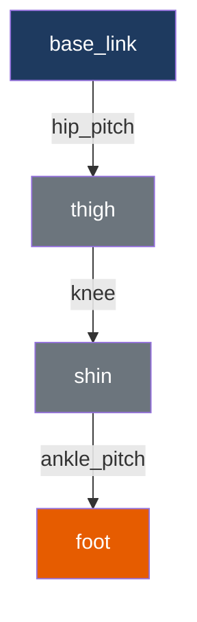

# URDF Basics: Modeling Humanoid Robots

The Unified Robot Description Format (URDF) is an XML format for describing robot models. Essential for visualization and simulation.

## Learning Objectives

- Understand URDF structure
- Define links and joints
- Model a simple humanoid leg
- Visualize in RViz2

## URDF Structure



A URDF consists of:
- **Links**: Rigid bodies (base, thigh, shin, foot)
- **Joints**: Connections between links (hip, knee, ankle)

## Basic URDF Template

```xml title="robot.urdf"
<?xml version="1.0"?>
<robot name="my_robot">

  <!-- Base Link -->
  <link name="base_link">
    <visual>
      <geometry>
        <box size="0.3 0.2 0.1"/>
      </geometry>
      <material name="blue">
        <color rgba="0 0 0.8 1"/>
      </material>
    </visual>
  </link>

</robot>
```

## Link Elements

### Visual Geometry

```xml
<link name="thigh">
  <visual>
    <origin xyz="0 0 -0.2" rpy="0 0 0"/>
    <geometry>
      <!-- Box: length x width x height -->
      <box size="0.1 0.1 0.4"/>

      <!-- Or cylinder: radius, length -->
      <!-- <cylinder radius="0.05" length="0.4"/> -->

      <!-- Or sphere: radius -->
      <!-- <sphere radius="0.05"/> -->

      <!-- Or mesh file -->
      <!-- <mesh filename="package://my_pkg/meshes/thigh.stl"/> -->
    </geometry>
    <material name="gray">
      <color rgba="0.5 0.5 0.5 1"/>
    </material>
  </visual>
</link>
```

### Collision Geometry

```xml
<link name="thigh">
  <visual>
    <!-- ... -->
  </visual>
  <collision>
    <origin xyz="0 0 -0.2" rpy="0 0 0"/>
    <geometry>
      <box size="0.1 0.1 0.4"/>
    </geometry>
  </collision>
</link>
```

### Inertial Properties

```xml
<link name="thigh">
  <visual><!-- ... --></visual>
  <collision><!-- ... --></collision>
  <inertial>
    <origin xyz="0 0 -0.2" rpy="0 0 0"/>
    <mass value="2.0"/>
    <inertia ixx="0.01" ixy="0" ixz="0"
             iyy="0.01" iyz="0"
             izz="0.005"/>
  </inertial>
</link>
```

## Joint Types

| Type | Motion | DOF | Use Case |
|------|--------|-----|----------|
| `revolute` | Rotation with limits | 1 | Knee, elbow |
| `continuous` | Unlimited rotation | 1 | Wheels |
| `prismatic` | Linear motion | 1 | Telescoping |
| `fixed` | No motion | 0 | Rigid attachment |
| `floating` | All motion | 6 | Free body |
| `planar` | 2D motion | 3 | Sliding |

### Revolute Joint (Most Common)

```xml
<joint name="knee_joint" type="revolute">
  <parent link="thigh"/>
  <child link="shin"/>
  <origin xyz="0 0 -0.4" rpy="0 0 0"/>
  <axis xyz="0 1 0"/>  <!-- Rotation around Y axis -->
  <limit lower="-2.0" upper="0.0" effort="100" velocity="2.0"/>
</joint>
```

## Complete Humanoid Leg

```xml title="humanoid_leg.urdf"
<?xml version="1.0"?>
<robot name="humanoid_leg">

  <!-- Materials -->
  <material name="blue">
    <color rgba="0.2 0.2 0.8 1"/>
  </material>
  <material name="gray">
    <color rgba="0.5 0.5 0.5 1"/>
  </material>
  <material name="orange">
    <color rgba="0.9 0.5 0.1 1"/>
  </material>

  <!-- Base (Pelvis) -->
  <link name="base_link">
    <visual>
      <geometry>
        <box size="0.3 0.4 0.15"/>
      </geometry>
      <material name="blue"/>
    </visual>
  </link>

  <!-- Hip Joint (Pitch) -->
  <joint name="hip_pitch" type="revolute">
    <parent link="base_link"/>
    <child link="thigh"/>
    <origin xyz="0 0.1 -0.075" rpy="0 0 0"/>
    <axis xyz="0 1 0"/>
    <limit lower="-1.57" upper="1.57" effort="100" velocity="2.0"/>
  </joint>

  <!-- Thigh -->
  <link name="thigh">
    <visual>
      <origin xyz="0 0 -0.2" rpy="0 0 0"/>
      <geometry>
        <cylinder radius="0.05" length="0.4"/>
      </geometry>
      <material name="gray"/>
    </visual>
  </link>

  <!-- Knee Joint -->
  <joint name="knee" type="revolute">
    <parent link="thigh"/>
    <child link="shin"/>
    <origin xyz="0 0 -0.4" rpy="0 0 0"/>
    <axis xyz="0 1 0"/>
    <limit lower="-2.5" upper="0.0" effort="100" velocity="2.0"/>
  </joint>

  <!-- Shin -->
  <link name="shin">
    <visual>
      <origin xyz="0 0 -0.2" rpy="0 0 0"/>
      <geometry>
        <cylinder radius="0.04" length="0.4"/>
      </geometry>
      <material name="gray"/>
    </visual>
  </link>

  <!-- Ankle Joint -->
  <joint name="ankle_pitch" type="revolute">
    <parent link="shin"/>
    <child link="foot"/>
    <origin xyz="0 0 -0.4" rpy="0 0 0"/>
    <axis xyz="0 1 0"/>
    <limit lower="-0.8" upper="0.8" effort="50" velocity="2.0"/>
  </joint>

  <!-- Foot -->
  <link name="foot">
    <visual>
      <origin xyz="0.05 0 -0.025" rpy="0 0 0"/>
      <geometry>
        <box size="0.2 0.1 0.05"/>
      </geometry>
      <material name="orange"/>
    </visual>
  </link>

</robot>
```

## Visualize in RViz2

Create a launch file:

```python title="launch/display_urdf.launch.py"
import os
from ament_index_python.packages import get_package_share_directory
from launch import LaunchDescription
from launch_ros.actions import Node
import xacro


def generate_launch_description():
    # Get URDF file
    urdf_file = os.path.join(
        get_package_share_directory('hello_ros2'),
        'urdf',
        'humanoid_leg.urdf'
    )

    with open(urdf_file, 'r') as f:
        robot_description = f.read()

    return LaunchDescription([
        # Robot State Publisher
        Node(
            package='robot_state_publisher',
            executable='robot_state_publisher',
            parameters=[{'robot_description': robot_description}]
        ),

        # Joint State Publisher GUI
        Node(
            package='joint_state_publisher_gui',
            executable='joint_state_publisher_gui',
        ),

        # RViz2
        Node(
            package='rviz2',
            executable='rviz2',
            arguments=['-d', os.path.join(
                get_package_share_directory('hello_ros2'),
                'rviz',
                'urdf.rviz'
            )]
        ),
    ])
```

### Setup Package

Create directories:

```bash
mkdir -p ~/ros2_ws/src/hello_ros2/urdf
mkdir -p ~/ros2_ws/src/hello_ros2/rviz
mkdir -p ~/ros2_ws/src/hello_ros2/launch
```

Update `setup.py`:

```python title="setup.py data_files"
import os
from glob import glob

data_files=[
    ('share/ament_index/resource_index/packages',
        ['resource/' + package_name]),
    ('share/' + package_name, ['package.xml']),
    (os.path.join('share', package_name, 'launch'),
     glob(os.path.join('launch', '*launch.[pxy][yma]*'))),
    (os.path.join('share', package_name, 'urdf'),
     glob(os.path.join('urdf', '*.urdf'))),
    (os.path.join('share', package_name, 'rviz'),
     glob(os.path.join('rviz', '*.rviz'))),
],
```

Install dependencies:

```bash
sudo apt install ros-humble-joint-state-publisher-gui ros-humble-robot-state-publisher
```

Build and launch:

```bash
cd ~/ros2_ws
colcon build --packages-select hello_ros2
source install/setup.bash
ros2 launch hello_ros2 display_urdf.launch.py
```

## Joint Hierarchy



## Transform Frames

Each link creates a TF frame:

```bash title="View TF tree"
ros2 run tf2_tools view_frames
```

## URDF Validation

Check your URDF for errors:

```bash title="Validate URDF"
check_urdf humanoid_leg.urdf
```

**Expected output:**
```
robot name is: humanoid_leg
---------- Successfully Parsed XML ---------------
root Link: base_link has 1 child(ren)
    child(1):  thigh
        child(1):  shin
            child(1):  foot
```

## Common Issues

### Joint Not Moving

- Check axis definition
- Verify parent/child relationship
- Ensure joint limits allow motion

### Visual Not Appearing

- Check origin offsets
- Verify geometry dimensions
- Confirm material definition

### TF Errors

- Ensure all links are connected
- Check for duplicate link names
- Verify joint naming

## Exercise: Add Hip Roll

Extend the leg with a hip roll joint:

1. Add `hip_roll` joint between `base_link` and a new `hip_roll_link`
2. Connect `hip_roll_link` to `thigh` via `hip_pitch`
3. Set rotation axis to `1 0 0` (X axis)

<details>
<summary>Click for Solution</summary>

```xml
<!-- Hip Roll Joint -->
<joint name="hip_roll" type="revolute">
  <parent link="base_link"/>
  <child link="hip_roll_link"/>
  <origin xyz="0 0.1 -0.075" rpy="0 0 0"/>
  <axis xyz="1 0 0"/>
  <limit lower="-0.5" upper="0.5" effort="100" velocity="2.0"/>
</joint>

<link name="hip_roll_link">
  <visual>
    <geometry>
      <sphere radius="0.03"/>
    </geometry>
    <material name="blue"/>
  </visual>
</link>

<!-- Update hip_pitch parent -->
<joint name="hip_pitch" type="revolute">
  <parent link="hip_roll_link"/>  <!-- Changed from base_link -->
  <child link="thigh"/>
  <!-- ... rest unchanged -->
</joint>
```

</details>

## Summary

You've learned to:
- ✅ Understand URDF structure
- ✅ Define links with visual/collision/inertial
- ✅ Create joints with proper limits
- ✅ Model a humanoid leg
- ✅ Visualize in RViz2

## Next Steps

Troubleshooting common issues:

**[Continue to Troubleshooting →](./troubleshooting)**
