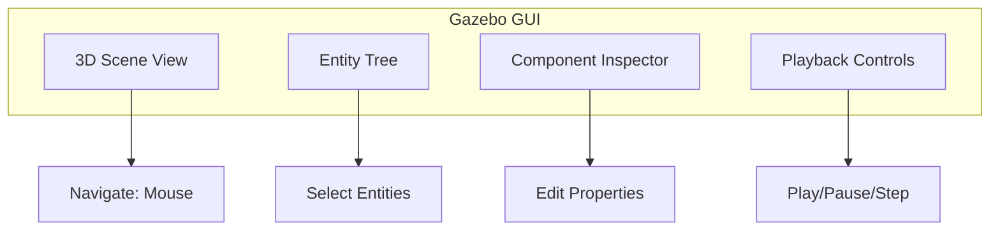

# Gazebo Basics

Learn to install Gazebo Harmonic and launch your first simulation.

## Learning Objectives

- Install Gazebo Harmonic on Ubuntu 22.04
- Understand Gazebo architecture
- Launch and navigate the Gazebo GUI
- Connect Gazebo to ROS 2

## Installation

### Add Gazebo Repository

```bash title="Add OSRF repository"
sudo apt-get update
sudo apt-get install lsb-release wget gnupg

sudo wget https://packages.osrfoundation.org/gazebo.gpg -O /usr/share/keyrings/pkgs-osrf-archive-keyring.gpg

echo "deb [arch=$(dpkg --print-architecture) signed-by=/usr/share/keyrings/pkgs-osrf-archive-keyring.gpg] http://packages.osrfoundation.org/gazebo/ubuntu-stable $(lsb_release -cs) main" | sudo tee /etc/apt/sources.list.d/gazebo-stable.list > /dev/null
```

### Install Gazebo Harmonic

```bash title="Install Gazebo"
sudo apt-get update
sudo apt-get install gz-harmonic -y
```

### Verify Installation

```bash title="Check version"
gz sim --version
```

**Expected**: `Gazebo Sim, version 8.x.x`

## Launch Empty World

```bash title="Launch Gazebo"
gz sim empty.sdf
```

You should see the Gazebo GUI with an empty world.

## GUI Overview



### Navigation Controls

| Action | Mouse/Key |
|--------|-----------|
| Orbit | Left-click + drag |
| Pan | Middle-click + drag |
| Zoom | Scroll wheel |
| Reset | Double-click |

## ROS 2 Integration

Install the ROS 2 Gazebo packages:

```bash title="Install ros_gz"
sudo apt install ros-humble-ros-gz -y
```

### Bridge Topics

The `ros_gz_bridge` connects Gazebo topics to ROS 2:

```bash title="Bridge example"
ros2 run ros_gz_bridge parameter_bridge /clock@rosgraph_msgs/msg/Clock[gz.msgs.Clock
```

## Sample World

Create a simple world file:

```xml title="simple_world.sdf"
<?xml version="1.0" ?>
<sdf version="1.8">
  <world name="simple_world">
    <!-- Physics -->
    <physics type="dart">
      <max_step_size>0.001</max_step_size>
      <real_time_factor>1.0</real_time_factor>
    </physics>

    <!-- Lighting -->
    <light type="directional" name="sun">
      <cast_shadows>true</cast_shadows>
      <pose>0 0 10 0 0 0</pose>
      <diffuse>0.8 0.8 0.8 1</diffuse>
    </light>

    <!-- Ground Plane -->
    <model name="ground_plane">
      <static>true</static>
      <link name="link">
        <collision name="collision">
          <geometry>
            <plane>
              <normal>0 0 1</normal>
              <size>100 100</size>
            </plane>
          </geometry>
        </collision>
        <visual name="visual">
          <geometry>
            <plane>
              <normal>0 0 1</normal>
              <size>100 100</size>
            </plane>
          </geometry>
          <material>
            <ambient>0.8 0.8 0.8 1</ambient>
          </material>
        </visual>
      </link>
    </model>
  </world>
</sdf>
```

Launch with:

```bash
gz sim simple_world.sdf
```

## Summary

You've learned to:
- ✅ Install Gazebo Harmonic
- ✅ Navigate the GUI
- ✅ Connect to ROS 2
- ✅ Create basic world files

**[Continue to Building Worlds →](./worlds)**
