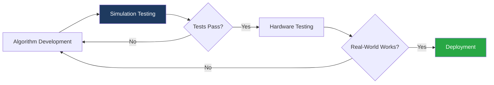
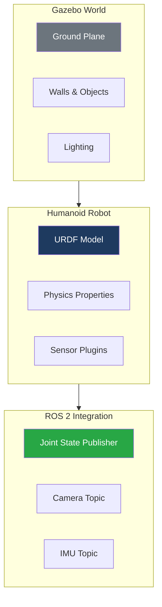
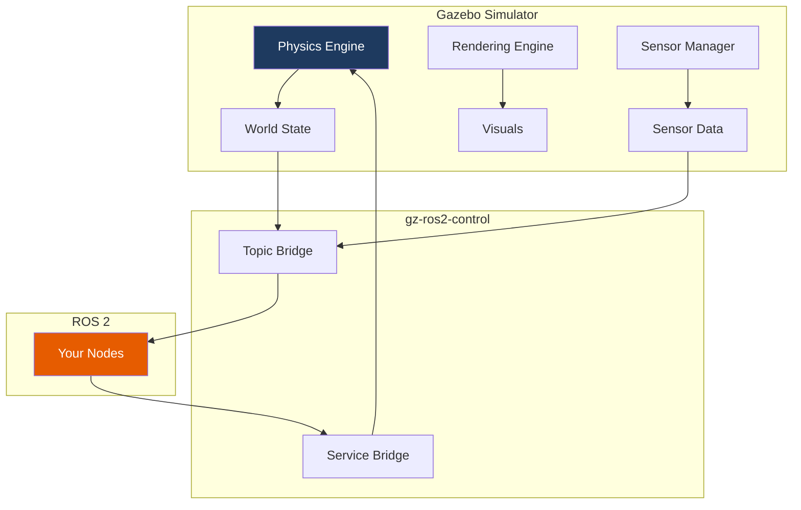

# Module 2: Digital Twins with Gazebo

Welcome to Module 2! In this module, you'll learn to create realistic physics simulations using Gazebo Harmonic - the industry-standard robotics simulator with native ROS 2 integration.

## Learning Objectives

By the end of this module, you will be able to:

- ✅ Install and configure Gazebo Harmonic
- ✅ Create custom simulation worlds using SDF
- ✅ Spawn URDF robots in Gazebo environments
- ✅ Tune physics parameters for realistic behavior
- ✅ Integrate sensor plugins (camera, lidar, IMU)
- ✅ Connect Gazebo simulations to ROS 2

## Why Simulation First?



Simulation provides:

| Benefit | Description |
|---------|-------------|
| **Safety** | Test dangerous maneuvers without risking hardware |
| **Speed** | Run thousands of tests overnight |
| **Cost** | No wear on expensive hardware |
| **Reproducibility** | Same conditions every time |
| **Debugging** | Full observability of all states |

## Module Structure

| Chapter | Topic | Duration |
|---------|-------|----------|
| 1 | [Gazebo Basics](./gazebo-basics) | 60 min |
| 2 | [Building Worlds](./worlds) | 60 min |
| 3 | [URDF to Simulation](./urdf-to-sim) | 45 min |
| 4 | [Physics Tuning](./physics-tuning) | 45 min |
| 5 | [Sensor Plugins](./plugins) | 60 min |
| 6 | [Troubleshooting](./troubleshooting) | Reference |

**Total Time: 6-8 hours**

## Prerequisites

Before starting this module, ensure you have:

- ✅ Completed Module 1: ROS 2 Fundamentals
- ✅ ROS 2 Humble installed and working
- ✅ OpenGL 3.3+ capable GPU (integrated or dedicated)
- ✅ At least 8GB RAM

:::tip GPU Recommendation
While Gazebo works with integrated graphics, a dedicated GPU significantly improves performance. NVIDIA GTX 1060+ or AMD RX 580+ recommended.
:::

## What You'll Build

Throughout this module, you'll create a complete simulation environment:



## Gazebo Harmonic Overview

Gazebo Harmonic (Gazebo 8) is the latest generation of the Gazebo simulator:

| Feature | Gazebo Harmonic |
|---------|-----------------|
| Physics Engine | DART, Bullet, ODE |
| Rendering | Ogre 2.x (PBR) |
| ROS 2 Integration | Native via gz-ros2 |
| SDF Version | 1.9+ |
| Platform | Ubuntu 22.04+ |

## Simulation Architecture



## Environment Setup Check

Before proceeding, verify your Gazebo installation:

```bash title="Verify Gazebo Harmonic"
gz sim --version
```

**Expected output:**
```
Gazebo Sim, version 8.x.x
```

Test with an empty world:

```bash title="Launch empty world"
gz sim empty.sdf
```

You should see the Gazebo GUI with a ground plane.

## Ready to Begin?

Let's start building digital twins:

**[Start Chapter 1: Gazebo Basics →](./gazebo-basics)**

---

**Module Progress:** 0/6 chapters completed
