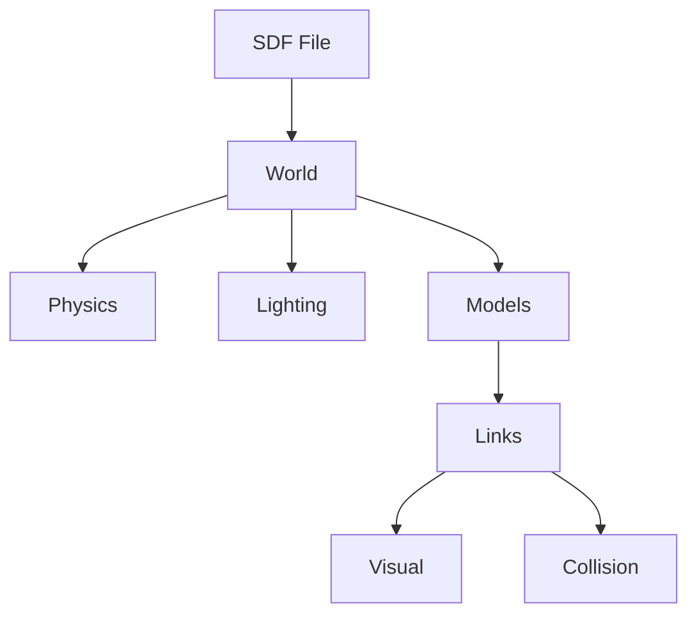

# Building Worlds

Learn to create custom simulation environments using the Simulation Description Format (SDF).

## Learning Objectives

- Understand SDF structure
- Add models and objects
- Configure physics and lighting
- Create reusable world files

## SDF Structure



## Adding Objects

### Box Model

```xml
<model name="box">
  <pose>2 0 0.5 0 0 0</pose>
  <link name="link">
    <collision name="collision">
      <geometry>
        <box><size>1 1 1</size></box>
      </geometry>
    </collision>
    <visual name="visual">
      <geometry>
        <box><size>1 1 1</size></box>
      </geometry>
      <material>
        <ambient>1 0 0 1</ambient>
      </material>
    </visual>
  </link>
</model>
```

### Cylinder Model

```xml
<model name="cylinder">
  <pose>0 2 0.5 0 0 0</pose>
  <link name="link">
    <collision name="collision">
      <geometry>
        <cylinder>
          <radius>0.5</radius>
          <length>1.0</length>
        </cylinder>
      </geometry>
    </collision>
    <visual name="visual">
      <geometry>
        <cylinder>
          <radius>0.5</radius>
          <length>1.0</length>
        </cylinder>
      </geometry>
    </visual>
  </link>
</model>
```

## Physics Configuration

```xml
<physics type="dart">
  <max_step_size>0.001</max_step_size>
  <real_time_factor>1.0</real_time_factor>
  <dart>
    <solver>
      <solver_type>dantzig</solver_type>
    </solver>
  </dart>
</physics>
```

## Summary

You've learned to:
- ✅ Structure SDF world files
- ✅ Add primitive shapes
- ✅ Configure physics
- ✅ Set up lighting

**[Continue to URDF to Simulation →](./urdf-to-sim)**
