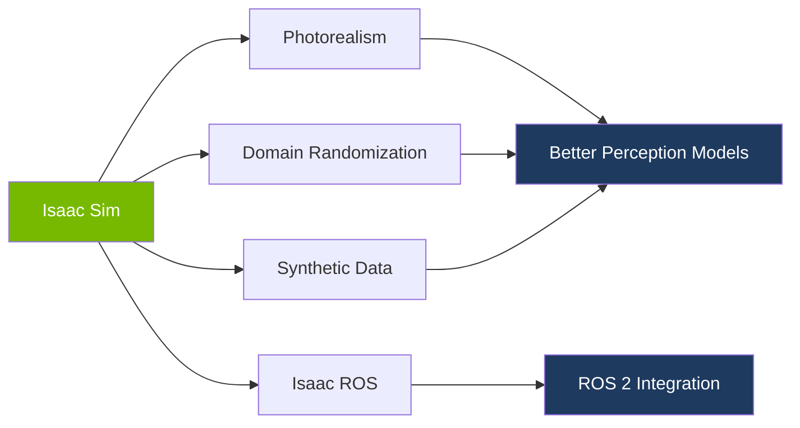
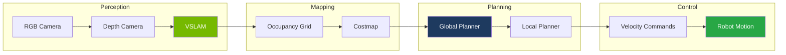
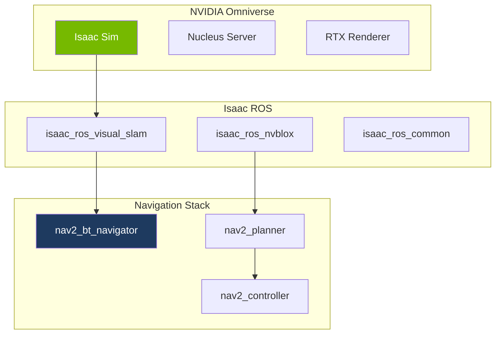
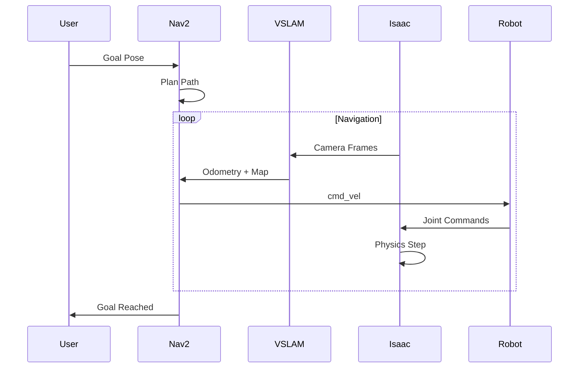

# Module 3: Isaac Sim & Navigation

Welcome to Module 3! In this module, you'll leverage NVIDIA Isaac Sim for photorealistic simulation and implement autonomous navigation using Visual SLAM and Nav2.

:::warning RTX GPU Required
This module requires an NVIDIA RTX 3070+ GPU with at least 8GB VRAM. If you don't have compatible hardware, see the [Cloud GPU Alternative](../prerequisites#cloud-gpu-alternative) section.
:::

## Learning Objectives

By the end of this module, you will be able to:

- ✅ Install and configure NVIDIA Isaac Sim
- ✅ Create photorealistic simulation scenes
- ✅ Integrate Isaac ROS packages with your robot
- ✅ Implement Visual SLAM for mapping
- ✅ Configure Nav2 for bipedal locomotion
- ✅ Navigate humanoid robots autonomously

## Why Isaac Sim?



Isaac Sim advantages over Gazebo:

| Feature | Gazebo | Isaac Sim |
|---------|--------|-----------|
| Rendering | Basic PBR | RTX Ray Tracing |
| Physics | Good | Excellent (PhysX 5) |
| Synthetic Data | Limited | Built-in |
| Domain Randomization | Manual | Automated |
| GPU Acceleration | Optional | Required |
| Learning Curve | Moderate | Steeper |

## Module Structure

| Chapter | Topic | Duration |
|---------|-------|----------|
| 1 | [Isaac Sim Setup](./isaac-setup) | 90 min |
| 2 | [Photorealistic Scenes](./photorealistic) | 60 min |
| 3 | [Isaac ROS Integration](./isaac-ros) | 60 min |
| 4 | [Visual SLAM](./vslam) | 60 min |
| 5 | [Nav2 Navigation](./nav2) | 90 min |
| 6 | [Troubleshooting](./troubleshooting) | Reference |

**Total Time: 6-8 hours**

## Prerequisites

Before starting this module, ensure you have:

- ✅ Completed Module 1 & 2
- ✅ NVIDIA RTX 3070+ GPU (8GB+ VRAM)
- ✅ NVIDIA Driver 535+ installed
- ✅ 32GB+ RAM recommended
- ✅ 50GB+ free disk space

### Hardware Verification

```bash title="Check NVIDIA GPU and Driver"
nvidia-smi
```

**Required output:**
- Driver Version: 535.x or higher
- CUDA Version: 12.x
- GPU: RTX 3070 or better

## What You'll Build

Throughout this module, you'll create a complete navigation system:



## Isaac Sim Architecture



## Navigation Pipeline

The complete navigation pipeline you'll implement:



## System Requirements Summary

| Component | Minimum | Recommended |
|-----------|---------|-------------|
| GPU | RTX 3070 | RTX 4080+ |
| VRAM | 8 GB | 16 GB |
| RAM | 32 GB | 64 GB |
| Storage | 50 GB SSD | 100 GB NVMe |
| Driver | 535.x | Latest |

## Ready to Begin?

Let's unlock photorealistic simulation:

**[Start Chapter 1: Isaac Sim Setup →](./isaac-setup)**

---

**Module Progress:** 0/6 chapters completed
