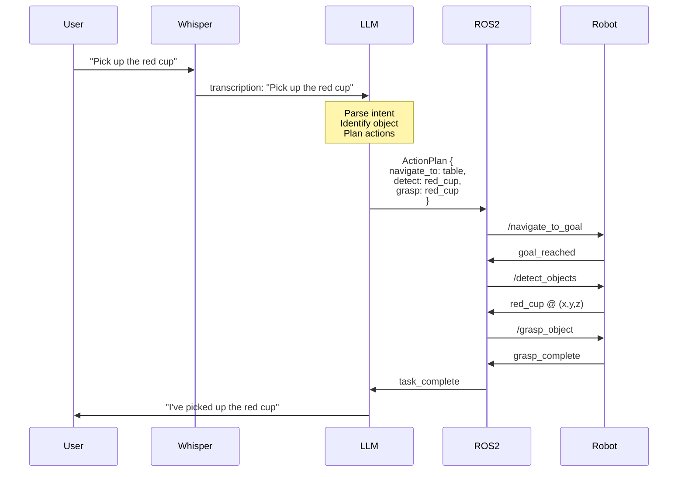
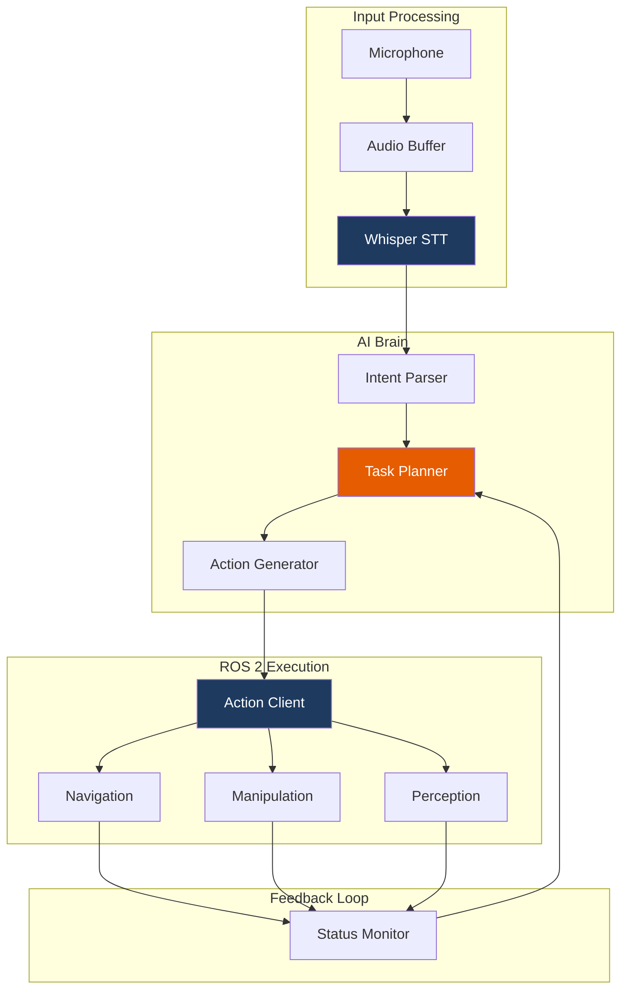

# Module 4: VLA & AI Brain

Welcome to Module 4! This is where your robot gains intelligence. You'll integrate Vision-Language-Action (VLA) models to create a system that understands voice commands and translates them into robot actions.

## Learning Objectives

By the end of this module, you will be able to:

- ✅ Integrate Whisper for real-time voice recognition
- ✅ Connect LLMs (Claude/Llama) for task planning
- ✅ Design action schemas for robot commands
- ✅ Build a complete VLA pipeline
- ✅ Handle errors and recovery gracefully
- ✅ Optimize latency for responsive interaction

## The VLA Pipeline


This is the core of Physical AI - transforming human intent into robot behavior:

| Stage | Component | Function |
|-------|-----------|----------|
| **Input** | Microphone | Capture voice command |
| **Speech-to-Text** | Whisper | Convert audio to text |
| **Understanding** | LLM | Parse intent, plan actions |
| **Execution** | ROS 2 | Dispatch robot commands |
| **Feedback** | Sensors | Monitor task progress |

## Module Structure

| Chapter | Topic | Duration |
|---------|-------|----------|
| 1 | [Whisper Integration](./whisper) | 90 min |
| 2 | [LLM Task Planner](./llm-planner) | 120 min |
| 3 | [VLA Pipeline](./vla-pipeline) | 120 min |
| 4 | [Troubleshooting](./troubleshooting) | Reference |

**Total Time: 8-10 hours**

## Prerequisites

Before starting this module, ensure you have:

- ✅ Completed Modules 1-3
- ✅ Working ROS 2 and Gazebo setup
- ✅ Python environment with pip
- ✅ API key for Claude or OpenAI (or local Llama setup)
- ✅ Microphone for voice input (optional for testing)

:::tip API Keys
You'll need either:
- **Anthropic API key** for Claude (recommended)
- **OpenAI API key** for GPT-4
- **Local setup** for Llama 3.1 (requires RTX GPU)
:::

## What You'll Build

A complete voice-to-action system:



## VLA Architecture



## Latency Budget

For responsive interaction, the total pipeline must complete within 3 seconds:

| Stage | Target | Actual |
|-------|--------|--------|
| Audio capture | 100ms | - |
| Whisper STT | 500ms | - |
| LLM planning | 1500ms | - |
| ROS 2 dispatch | 100ms | - |
| **Total** | **&lt;3000ms** | - |

You'll measure and optimize these during the module.

## Technology Options

### Speech-to-Text

| Option | Latency | Privacy | Quality |
|--------|---------|---------|---------|
| Whisper (local) | ~500ms | ✅ High | Excellent |
| Whisper API | ~300ms | ❌ Cloud | Excellent |
| Google STT | ~200ms | ❌ Cloud | Good |

### LLM Planning

| Option | Latency | Cost | Quality |
|--------|---------|------|---------|
| Claude 3.5 Sonnet | ~1s | $$ | Excellent |
| GPT-4 | ~1.5s | $$$ | Excellent |
| Llama 3.1 (local) | ~2s | Free | Good |

## Action Schema Preview

You'll define structured action schemas like this:

```json title="action_schema.json"
{
  "action": "pick_object",
  "parameters": {
    "object_id": "red_cup",
    "location": {"x": 1.2, "y": 0.5, "z": 0.8},
    "grasp_type": "power"
  },
  "preconditions": [
    "robot_at_table",
    "object_detected"
  ],
  "effects": [
    "holding_object"
  ]
}
```

## Ready to Begin?

Let's give your robot a brain:

**[Start Chapter 1: Whisper Integration →](./whisper)**

---

**Module Progress:** 0/4 chapters completed
