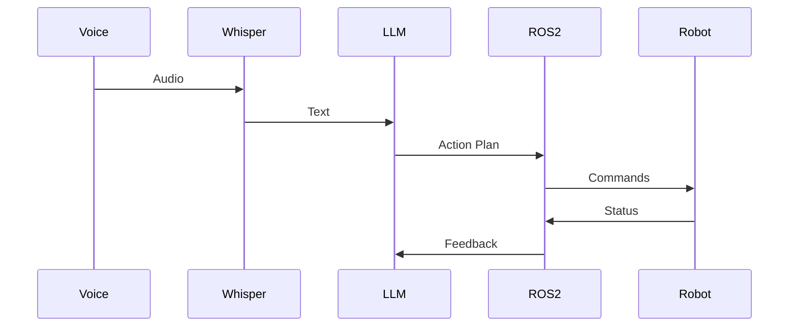

# VLA Pipeline

Integrate voice, language, and action into a complete system.

## Learning Objectives

- Connect all VLA components
- Handle action execution
- Implement feedback loops
- Optimize latency

## Pipeline Architecture

## Summary

**[Continue to Troubleshooting →](./troubleshooting)**
