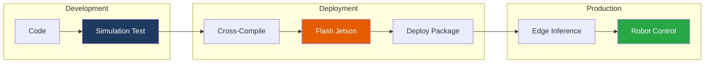
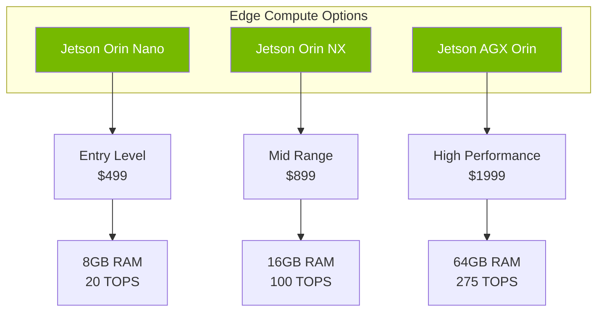
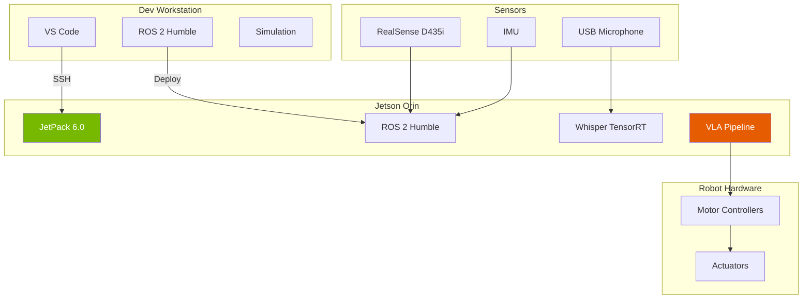
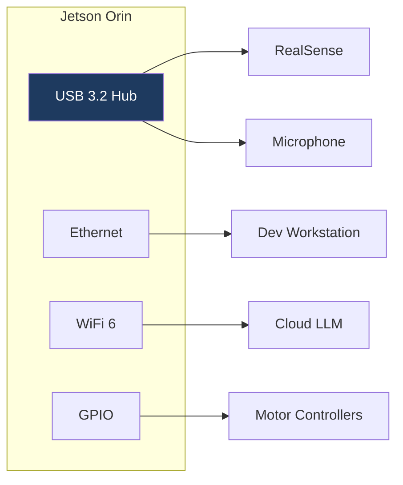

# Module 5: Hardware & Deployment

Welcome to Module 5! In this final module before the capstone, you'll learn to deploy your Physical AI system from simulation to real hardware, including workstation setup, Jetson edge deployment, and sensor integration.

## Learning Objectives

By the end of this module, you will be able to:

- ✅ Configure a development workstation for robotics
- ✅ Flash and setup Jetson Orin devices
- ✅ Deploy ROS 2 applications to edge hardware
- ✅ Integrate cameras, IMUs, and microphones
- ✅ Optimize Whisper for edge inference
- ✅ Debug hardware communication issues

## From Simulation to Reality

## Module Structure

| Chapter | Topic | Duration |
|---------|-------|----------|
| 1 | [Workstation Specs](./workstation-specs) | 30 min |
| 2 | [Jetson Deployment](./jetson-deployment) | 90 min |
| 3 | [Sensor Integration](./sensor-integration) | 60 min |
| 4 | [Troubleshooting](./troubleshooting) | Reference |

**Total Time: 4-6 hours**

## Prerequisites

Before starting this module, ensure you have:

- ✅ Completed Modules 1-4
- ✅ Working VLA pipeline in simulation
- ✅ Access to target hardware (optional for reading)

:::info Hardware Optional
You can complete this module by reading and understanding the concepts. Actual hardware deployment requires the specific devices listed below.
:::

## Hardware Overview

### Development Workstation

| Component | Minimum | Recommended |
|-----------|---------|-------------|
| CPU | 8-core | 16-core |
| RAM | 32 GB | 64 GB |
| GPU | RTX 3070 | RTX 4080 |
| Storage | 512 GB SSD | 1 TB NVMe |
| OS | Ubuntu 22.04 | Ubuntu 22.04 |

### Edge Deployment Options

### Recommended Sensors

| Sensor | Model | Purpose |
|--------|-------|---------|
| RGB-D Camera | Intel RealSense D435i | Depth perception |
| IMU | Built into D435i | Orientation |
| Microphone | USB Array | Voice input |
| Lidar (optional) | RPLidar A1 | 2D mapping |

## Deployment Architecture

## Edge Optimization

Key optimizations for real-time performance on Jetson:

| Component | Desktop | Jetson Optimized |
|-----------|---------|------------------|
| Whisper | whisper-large | whisper-tiny + TensorRT |
| LLM | Claude API | Llama 3.1 8B quantized |
| Inference | PyTorch | TensorRT |
| Camera | OpenCV | GStreamer + NVDEC |

## Power Budget

For portable/mobile robots:

| Component | Power Draw |
|-----------|------------|
| Jetson Orin NX | 15-25W |
| RealSense D435i | 2.5W |
| Microphone | 0.5W |
| Total Compute | ~30W |

## Connectivity

## What You'll Learn

### Chapter 1: Workstation Specs
- GPU verification and CUDA setup
- ROS 2 workspace configuration
- Development environment optimization

### Chapter 2: Jetson Deployment
- JetPack SDK installation
- ROS 2 cross-compilation
- Package deployment workflow
- Whisper TensorRT optimization

### Chapter 3: Sensor Integration
- RealSense camera setup
- IMU calibration
- Microphone configuration
- ROS 2 driver installation

## Ready to Begin?

Let's bring your robot to life:

**[Start Chapter 1: Workstation Specs →](./workstation-specs)**

---

**Module Progress:** 0/4 chapters completed
