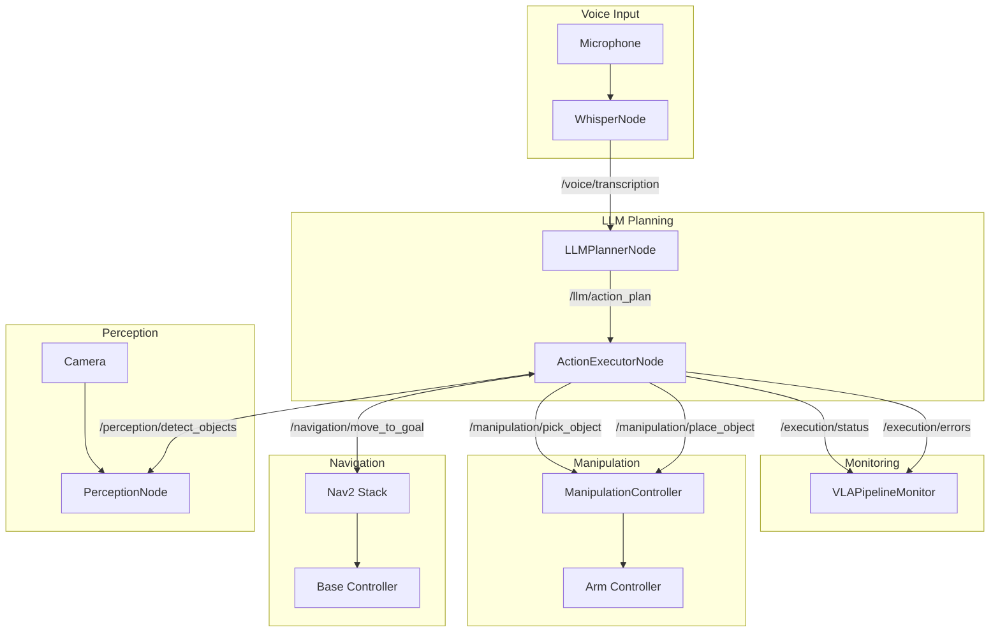

# VLA ROS 2 Interface Contracts

**Feature Branch**: `001-physical-ai-ebook`
**Date**: 2025-12-07
**Purpose**: Define ROS 2 message, service, and action interfaces for VLA pipeline

## Overview

This document defines the ROS 2 interface contracts for the Vision-Language-Action (VLA) pipeline demonstrated in Module 4 and the Capstone project. These interfaces establish the communication patterns between Whisper transcription, LLM planning, and robot action execution.

---

## 1. Voice Transcription Interface

### Topic: `/voice/transcription`

**Message Type**: `std_msgs/msg/String`

```python
# Message structure
string data  # Transcribed text from Whisper
```

**Publisher**: WhisperNode
**Subscribers**: LLMPlannerNode
**QoS**: Reliable, depth=10

### Example Message

```json
{
  "data": "Pick up the red cup and place it on the table"
}
```

---

## 2. LLM Planning Interface

### Topic: `/llm/action_plan`

**Custom Message Type**: `vla_msgs/msg/ActionPlan`

```python
# vla_msgs/msg/ActionPlan.msg
std_msgs/Header header
string original_command        # User's voice command
ActionGoal[] goals             # Ordered list of action goals
string status                  # planning | ready | error
string error_message           # Populated if status == error
```

### Sub-message: ActionGoal

```python
# vla_msgs/msg/ActionGoal.msg
string action_type             # navigation | manipulation | perception
string action_name             # e.g., move_to_goal, pick_object
string[] required_params       # Parameter names
string params_json             # JSON-encoded parameters
int32 sequence_order           # Execution order (1, 2, 3...)
float32 estimated_duration     # Estimated seconds
```

**Publisher**: LLMPlannerNode
**Subscribers**: ActionExecutorNode
**QoS**: Reliable, depth=5

### Example Message

```json
{
  "header": {"stamp": {"sec": 1733600000, "nanosec": 0}},
  "original_command": "Pick up the red cup",
  "goals": [
    {
      "action_type": "perception",
      "action_name": "detect_objects",
      "required_params": ["object_class"],
      "params_json": "{\"object_class\": \"cup\", \"color\": \"red\"}",
      "sequence_order": 1,
      "estimated_duration": 2.0
    },
    {
      "action_type": "manipulation",
      "action_name": "pick_object",
      "required_params": ["object_id", "grasp_type"],
      "params_json": "{\"object_id\": \"cup_001\", \"grasp_type\": \"power\"}",
      "sequence_order": 2,
      "estimated_duration": 5.0
    }
  ],
  "status": "ready",
  "error_message": ""
}
```

---

## 3. Navigation Action Interface

### Action: `/navigation/move_to_goal`

**Action Type**: `nav2_msgs/action/NavigateToPose`

```python
# Goal
geometry_msgs/PoseStamped pose
string behavior_tree           # Optional, default nav2 behavior

# Result
std_msgs/Empty result

# Feedback
geometry_msgs/PoseStamped current_pose
float32 distance_remaining
float32 estimated_time_remaining
int16 number_of_recoveries
```

**Action Server**: Nav2 Navigation Stack
**Action Client**: ActionExecutorNode

### Example Goal

```python
goal = NavigateToPose.Goal()
goal.pose.header.frame_id = "map"
goal.pose.pose.position.x = 1.5
goal.pose.pose.position.y = 2.0
goal.pose.pose.orientation.w = 1.0
```

---

## 4. Manipulation Action Interface

### Action: `/manipulation/pick_object`

**Custom Action Type**: `vla_msgs/action/PickObject`

```python
# Goal
string object_id               # Detected object ID
string grasp_type              # power | pinch | hook
float32 timeout_sec            # Maximum execution time

# Result
bool success
string message
geometry_msgs/Pose final_gripper_pose

# Feedback
string current_phase           # approaching | grasping | lifting | complete
float32 progress_percent
```

**Action Server**: ManipulationController
**Action Client**: ActionExecutorNode

### Action: `/manipulation/place_object`

**Custom Action Type**: `vla_msgs/action/PlaceObject`

```python
# Goal
geometry_msgs/PoseStamped target_pose
float32 approach_height        # Height above target before descent
float32 timeout_sec

# Result
bool success
string message

# Feedback
string current_phase           # approaching | descending | releasing | retracting
float32 progress_percent
```

---

## 5. Perception Service Interface

### Service: `/perception/detect_objects`

**Custom Service Type**: `vla_msgs/srv/DetectObjects`

```python
# Request
string object_class            # e.g., "cup", "bottle", "all"
string color_filter            # Optional: "red", "blue", ""
float32 confidence_threshold   # Default: 0.7

# Response
bool success
DetectedObject[] objects
string error_message
```

### Sub-message: DetectedObject

```python
# vla_msgs/msg/DetectedObject.msg
string object_id               # Unique ID for this detection
string object_class            # Classified type
float32 confidence             # Detection confidence (0-1)
geometry_msgs/PoseStamped pose # Object pose in world frame
geometry_msgs/Vector3 dimensions  # Bounding box size
string[] properties            # Additional properties (color, etc.)
```

**Service Server**: PerceptionNode
**Service Client**: ActionExecutorNode

### Example Request/Response

```python
# Request
request.object_class = "cup"
request.color_filter = "red"
request.confidence_threshold = 0.8

# Response
response.success = True
response.objects = [
    DetectedObject(
        object_id="cup_001",
        object_class="cup",
        confidence=0.92,
        pose=PoseStamped(...),
        dimensions=Vector3(x=0.08, y=0.08, z=0.12),
        properties=["red", "ceramic"]
    )
]
```

---

## 6. Execution Status Interface

### Topic: `/execution/status`

**Custom Message Type**: `vla_msgs/msg/ExecutionStatus`

```python
# vla_msgs/msg/ExecutionStatus.msg
std_msgs/Header header
string plan_id                 # Reference to original plan
int32 current_goal_index       # Which goal is executing (0-based)
int32 total_goals              # Total goals in plan
string current_action          # Action name being executed
string status                  # pending | executing | completed | failed | aborted
string message                 # Human-readable status
float32 overall_progress       # 0.0 to 1.0
```

**Publisher**: ActionExecutorNode
**Subscribers**: VLAPipelineMonitor, UI components
**QoS**: Reliable, depth=20

---

## 7. Error and Recovery Interface

### Topic: `/execution/errors`

**Custom Message Type**: `vla_msgs/msg/ExecutionError`

```python
# vla_msgs/msg/ExecutionError.msg
std_msgs/Header header
string plan_id
int32 failed_goal_index
string action_name
string error_code              # TIMEOUT | COLLISION | OBJECT_NOT_FOUND | HARDWARE_ERROR
string error_message
bool recoverable
string[] recovery_suggestions
```

### Recovery Codes

| Code | Description | Recovery |
|------|-------------|----------|
| `TIMEOUT` | Action exceeded timeout | Retry with extended timeout |
| `COLLISION` | Detected collision during motion | Replan path |
| `OBJECT_NOT_FOUND` | Perception failed to detect object | Retry perception with lower threshold |
| `HARDWARE_ERROR` | Actuator/sensor failure | Manual intervention required |
| `PLANNING_FAILED` | Motion planner failed | Try alternative approach |

---

## 8. Node Communication Diagram



---

## 9. Latency Requirements

| Interface | Type | Max Latency | Notes |
|-----------|------|-------------|-------|
| `/voice/transcription` | Topic | 500ms | Whisper inference included |
| `/llm/action_plan` | Topic | 2000ms | LLM API call included |
| `/perception/detect_objects` | Service | 300ms | GPU inference |
| `/navigation/move_to_goal` | Action | N/A | Long-running, feedback provided |
| `/manipulation/pick_object` | Action | N/A | Long-running, feedback provided |
| `/execution/status` | Topic | 50ms | High-frequency updates |

---

## 10. Message Package Structure

```text
vla_msgs/
├── msg/
│   ├── ActionGoal.msg
│   ├── ActionPlan.msg
│   ├── DetectedObject.msg
│   ├── ExecutionStatus.msg
│   └── ExecutionError.msg
├── srv/
│   └── DetectObjects.srv
├── action/
│   ├── PickObject.action
│   └── PlaceObject.action
├── CMakeLists.txt
└── package.xml
```

---

## 11. Validation Checklist

- [ ] All message types compile without errors
- [ ] Interface names follow ROS 2 naming conventions
- [ ] QoS profiles are appropriate for each interface
- [ ] Error handling covers all failure modes
- [ ] Latency budgets are achievable on target hardware
- [ ] Interfaces are documented with examples
