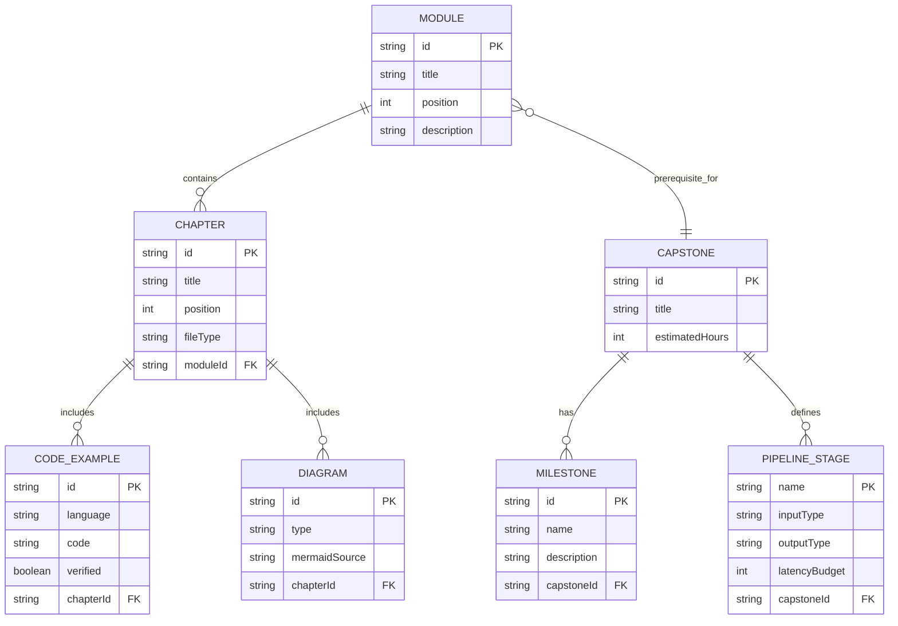
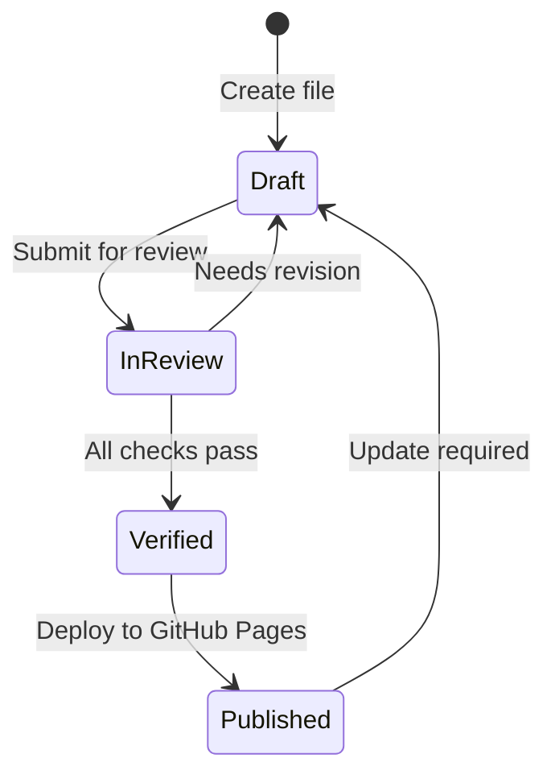
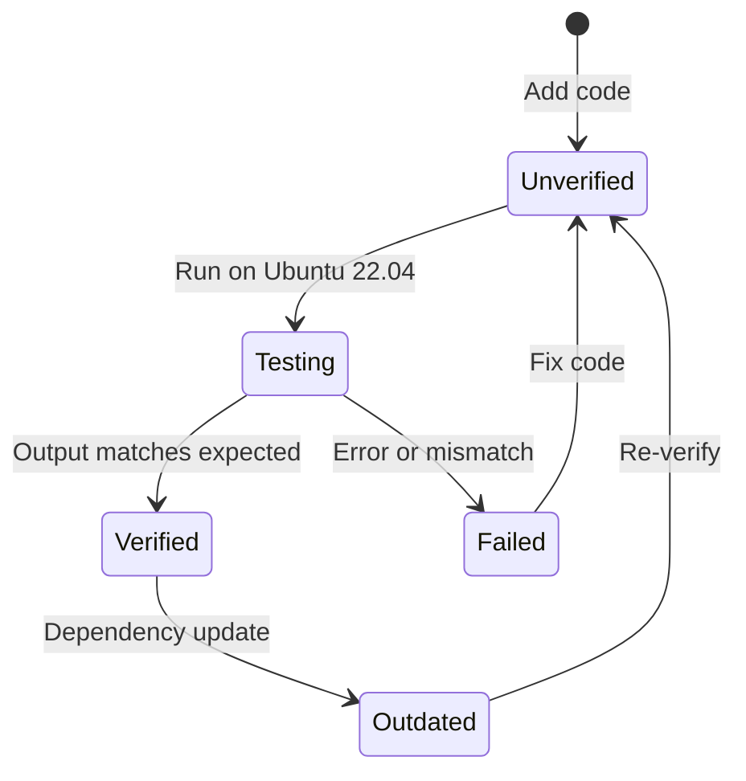

# Data Model: Physical AI & Humanoid Robotics E-Book

**Feature Branch**: `001-physical-ai-ebook`
**Date**: 2025-12-07
**Source**: Feature Specification + Research Findings

## Overview

This document defines the key entities and their relationships for the Physical AI E-Book content structure. The model supports Docusaurus content organization and ensures consistency across all modules.

---

## Core Entities

### 1. Module

A thematic unit of instruction representing a major learning area.

| Attribute | Type | Required | Description |
|-----------|------|----------|-------------|
| `id` | string | Yes | Unique identifier (e.g., `module-1-ros2`) |
| `title` | string | Yes | Display title (e.g., "ROS 2 Fundamentals") |
| `position` | number | Yes | Order in learning path (1-5) |
| `description` | string | Yes | 1-2 sentence module summary |
| `learningObjectives` | string[] | Yes | List of measurable outcomes |
| `prerequisites` | string[] | No | Required prior knowledge |
| `chapters` | Chapter[] | Yes | Ordered list of chapters |
| `collapsed` | boolean | No | Sidebar collapsed state (default: true) |

**Cardinality**: 5 modules total (ROS 2, Gazebo, Isaac, VLA, Hardware)

### 2. Chapter

An individual lesson within a module.

| Attribute | Type | Required | Description |
|-----------|------|----------|-------------|
| `id` | string | Yes | Unique identifier (e.g., `01-intro`) |
| `title` | string | Yes | Chapter title |
| `position` | number | Yes | Order within module (01, 02, ...) |
| `fileType` | enum | Yes | `md` or `mdx` |
| `estimatedTime` | number | No | Minutes to complete |
| `tags` | string[] | No | Topic tags for search |
| `codeExamples` | CodeExample[] | No | Embedded code snippets |
| `diagrams` | Diagram[] | No | Mermaid diagrams |
| `troubleshootingSection` | boolean | Yes | Has troubleshooting content |

**Validation Rules**:
- Each module must have at least 3 chapters
- Each chapter must have learning objectives in the intro section
- Troubleshooting chapters are required for each module

### 3. CodeExample

Executable code snippet with metadata.

| Attribute | Type | Required | Description |
|-----------|------|----------|-------------|
| `id` | string | Yes | Unique identifier |
| `language` | enum | Yes | `python`, `bash`, `xml`, `yaml`, `cpp` |
| `title` | string | No | Filename or descriptor (e.g., `my_node.py`) |
| `prerequisites` | string[] | Yes | Required packages/tools |
| `code` | string | Yes | The actual code content |
| `expectedOutput` | string | No | What the user should see |
| `highlightedLines` | number[] | No | Lines to emphasize |
| `verified` | boolean | Yes | Tested on Ubuntu 22.04 |
| `verificationDate` | date | No | When last verified |

**Validation Rules**:
- All code examples must be verified on Ubuntu 22.04
- Prerequisites must be explicit (no implicit dependencies)
- Expected output must match actual output

### 4. Diagram

Mermaid-based visualization.

| Attribute | Type | Required | Description |
|-----------|------|----------|-------------|
| `id` | string | Yes | Unique identifier |
| `type` | enum | Yes | `flowchart`, `sequence`, `graph`, `state`, `class` |
| `title` | string | Yes | Caption/description |
| `mermaidSource` | string | Yes | Mermaid code |
| `fallbackImage` | string | No | Path to PNG/SVG fallback |
| `chapter` | string | Yes | Parent chapter reference |

**Validation Rules**:
- All diagrams must render in Docusaurus without errors
- Fallback images stored in `static/img/mermaid-fallbacks/`

### 5. CapstoneProject

The culminating hands-on project.

| Attribute | Type | Required | Description |
|-----------|------|----------|-------------|
| `id` | string | Yes | `capstone-vla-pipeline` |
| `title` | string | Yes | "Voice-to-Action Humanoid System" |
| `prerequisiteModules` | string[] | Yes | All 4 prior modules |
| `milestones` | Milestone[] | Yes | Progress checkpoints |
| `estimatedHours` | number | Yes | 4 hours (per spec) |
| `pipelineStages` | PipelineStage[] | Yes | Voice → Whisper → LLM → ROS 2 → Action |

### 6. Milestone (Capstone Sub-entity)

Progress checkpoint within capstone.

| Attribute | Type | Required | Description |
|-----------|------|----------|-------------|
| `id` | string | Yes | Unique identifier |
| `name` | string | Yes | Milestone name |
| `description` | string | Yes | What to accomplish |
| `validationCriteria` | string[] | Yes | How to verify completion |
| `estimatedMinutes` | number | No | Time to complete |

### 7. PipelineStage (Capstone Sub-entity)

Stage in the VLA pipeline.

| Attribute | Type | Required | Description |
|-----------|------|----------|-------------|
| `name` | string | Yes | Stage name (Voice, Whisper, LLM, ROS 2, Action) |
| `inputType` | string | Yes | Expected input format |
| `outputType` | string | Yes | Output format |
| `rosTopics` | string[] | No | ROS 2 topics/services/actions used |
| `latencyBudget` | number | No | Target latency in ms |

---

## Entity Relationships

---

## Content Inventory

### Module 1: ROS 2 Fundamentals

| Chapter | Type | Code Examples | Diagrams |
|---------|------|---------------|----------|
| 01-intro | md | 0 | 1 (learning path) |
| 02-concepts | md | 0 | 3 (nodes, topics, services) |
| 03-setup | md | 5 (install commands) | 0 |
| 04-hello-ros2 | md | 2 (Python node) | 0 |
| 05-pubsub | md | 3 (publisher, subscriber, launch) | 1 (flow diagram) |
| 06-services | md | 2 (client, server) | 1 (sequence diagram) |
| 07-actions | md | 3 (action server, client) | 1 (action flow) |
| 08-urdf-basics | md | 4 (URDF samples) | 1 (joint hierarchy) |
| 09-troubleshooting | md | 0 | 0 |

### Module 2: Digital Twins (Gazebo)

| Chapter | Type | Code Examples | Diagrams |
|---------|------|---------------|----------|
| 01-intro | md | 0 | 1 (simulation overview) |
| 02-gazebo-basics | md | 4 (install, launch) | 0 |
| 03-worlds | md | 3 (SDF world files) | 1 (world structure) |
| 04-urdf-to-sim | md | 2 (spawn commands) | 1 (URDF to SDF) |
| 05-physics-tuning | md | 3 (parameter files) | 0 |
| 06-plugins | md | 4 (sensor plugins) | 1 (plugin architecture) |
| 07-troubleshooting | md | 0 | 0 |

### Module 3: Isaac Sim & Navigation

| Chapter | Type | Code Examples | Diagrams |
|---------|------|---------------|----------|
| 01-intro | md | 0 | 1 (Isaac ecosystem) |
| 02-isaac-setup | md | 5 (Omniverse install) | 0 |
| 03-photorealistic | md | 3 (scene setup) | 1 (rendering pipeline) |
| 04-isaac-ros | md | 4 (Isaac ROS packages) | 1 (Isaac ROS stack) |
| 05-vslam | md | 3 (VSLAM commands) | 1 (SLAM flow) |
| 06-nav2 | md | 4 (Nav2 config) | 1 (Nav2 architecture) |
| 07-troubleshooting | md | 0 | 0 |

### Module 4: VLA & AI Brain

| Chapter | Type | Code Examples | Diagrams |
|---------|------|---------------|----------|
| 01-intro | md | 0 | 1 (VLA pipeline) |
| 02-whisper | mdx | 4 (Whisper integration) | 1 (voice pipeline) |
| 03-llm-planner | mdx | 5 (Claude/Llama) | 1 (LLM flow) |
| 04-vla-pipeline | mdx | 6 (full integration) | 1 (end-to-end) |
| 05-troubleshooting | md | 0 | 0 |

### Module 5: Hardware & Deployment

| Chapter | Type | Code Examples | Diagrams |
|---------|------|---------------|----------|
| 01-intro | md | 0 | 1 (hardware stack) |
| 02-workstation-specs | md | 2 (nvidia-smi, GPU check) | 0 |
| 03-jetson-deployment | md | 5 (flash, deploy) | 1 (edge architecture) |
| 04-sensor-integration | md | 4 (RealSense, IMU) | 1 (sensor stack) |
| 05-troubleshooting | md | 0 | 0 |

### Capstone Project

| Chapter | Type | Code Examples | Diagrams |
|---------|------|---------------|----------|
| 00-overview | mdx | 0 | 1 (full system) |
| 01-integration | md | 6 (integration steps) | 1 (component diagram) |
| 02-testing | md | 4 (test commands) | 0 |
| 03-deployment | md | 3 (deploy scripts) | 0 |
| 04-demo-scripts | md | 3 (demo code) | 0 |

---

## Totals

| Metric | Count |
|--------|-------|
| Modules | 5 |
| Chapters | 35 |
| Code Examples | ~80 |
| Diagrams | ~20 |
| MDX Files | 4 |
| MD Files | 31 |

---

## State Transitions

### Chapter Status

### Code Example Verification

---

## Validation Checklist

Per constitution requirements:

- [ ] All code examples verified on Ubuntu 22.04
- [ ] All diagrams render in Docusaurus build
- [ ] All external links point to official documentation
- [ ] APA citations included for all technical claims
- [ ] Flesch-Kincaid grade 9-12 readability
- [ ] Each module has troubleshooting section
- [ ] Capstone pipeline works end-to-end in simulation
