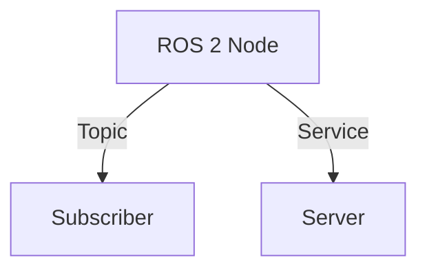

# Quickstart: Physical AI E-Book Development

**Feature Branch**: `001-physical-ai-ebook`
**Date**: 2025-12-07
**Purpose**: Quick reference for e-book content authors

---

## Development Environment

### Prerequisites

```bash
# Required
- Ubuntu 22.04 (native or WSL2)
- Node.js 20+ (for Docusaurus)
- Git

# Recommended
- VS Code with Markdown extensions
- NVIDIA RTX 3070+ (for simulation validation)
- ROS 2 Humble (for code example verification)
```

### Initial Setup

```bash
# Clone and enter project
cd e-book-hackathon-2025/my-website

# Install dependencies
npm install

# Start development server
npm run start
# Opens at http://localhost:3000
```

---

## Content Structure

### File Locations

```text
my-website/docs/
├── intro.md                    # Landing page
├── prerequisites.md            # System requirements
├── module-1-ros2/              # Module 1 content
│   ├── _category_.json         # Sidebar metadata
│   ├── 01-intro.md             # Chapter 1
│   └── ...
├── module-2-gazebo/            # Module 2 content
├── module-3-isaac/             # Module 3 content
├── module-4-vla/               # Module 4 content (includes .mdx)
├── module-5-hardware/          # Module 5 content
├── capstone/                   # Capstone project
└── appendix/                   # Reference materials
```

### Creating a New Chapter

1. Create file: `docs/module-X/NN-topic.md`
2. Add front matter:

```markdown
---
id: topic-slug
title: Chapter Title
description: Brief description for SEO
sidebar_position: 2
tags: [tag1, tag2]
---

# Chapter Title

## Learning Objectives

- Objective 1
- Objective 2

## Content

[Your content here]

## Summary

[Key takeaways]
```

---

## Writing Guidelines

### Code Examples

```markdown
```python title="src/my_node.py" {1,3-5}
import rclpy
# highlight-next-line
from rclpy.node import Node

class MyNode(Node):
    def __init__(self):
        super().__init__('my_node')
```
```

**Requirements**:
- Include `title` for filename context
- Use `{1,3-5}` for line highlighting
- Add `# highlight-next-line` for single line emphasis
- Verify all code runs on Ubuntu 22.04

### Mermaid Diagrams

```markdown

```

**Supported types**: flowchart, sequence, graph, state, class, gantt

### MDX Components (Module 4 & Capstone only)

```mdx
import Tabs from '@theme/Tabs';
import TabItem from '@theme/TabItem';

<Tabs>
  <TabItem value="python" label="Python">
    ```python
    # Python code
    ```
  </TabItem>
  <TabItem value="cpp" label="C++">
    ```cpp
    // C++ code
    ```
  </TabItem>
</Tabs>
```

---

## Verification Checklist

### Before Commit

```bash
# Build check
npm run build

# Start and visually verify
npm run start

# Check for broken links
npm run build 2>&1 | grep -i "broken"
```

### Code Example Verification

1. Copy code to Ubuntu 22.04 environment
2. Install documented prerequisites
3. Run code and capture output
4. Verify output matches `expectedOutput` in example
5. Update `verificationDate` in front matter

### Content Quality

- [ ] No implementation details in spec-level content
- [ ] All claims cite official documentation (APA format)
- [ ] Flesch-Kincaid grade 9-12 readability
- [ ] Troubleshooting section covers common errors
- [ ] Learning objectives are measurable

---

## Common Tasks

### Add New Module

1. Create directory: `docs/module-N-name/`
2. Add `_category_.json`:

```json
{
  "label": "Module N: Title",
  "position": N,
  "collapsed": true,
  "link": {
    "type": "generated-index",
    "description": "Module description"
  }
}
```

3. Create chapters following `NN-topic.md` pattern
4. Update `sidebars.ts` if using manual configuration

### Add Mermaid Fallback Image

```bash
# Generate PNG from Mermaid
npx mmdc -i diagram.mermaid -o static/img/mermaid-fallbacks/diagram.png

# Reference in markdown

```

### Update Sidebar

Edit `sidebars.ts`:

```typescript
{
  type: 'category',
  label: 'Module N: Title',
  collapsed: true,
  items: [
    'module-n-name/01-intro',
    'module-n-name/02-concepts',
    // ...
  ],
}
```

---

## Deployment

### Build for Production

```bash
npm run build
# Output in build/
```

### Deploy to GitHub Pages

```bash
# Configure in docusaurus.config.ts first
npm run deploy
```

### Configuration for GitHub Pages

```typescript
// docusaurus.config.ts
const config = {
  url: 'https://YOUR-USERNAME.github.io',
  baseUrl: '/e-book-hackathon-2025/',
  organizationName: 'YOUR-USERNAME',
  projectName: 'e-book-hackathon-2025',
  // ...
};
```

---

## Troubleshooting

### Build Errors

```bash
# Clear cache
npm run clear

# Reinstall dependencies
rm -rf node_modules package-lock.json
npm install
```

### Mermaid Not Rendering

1. Check Mermaid syntax at: https://mermaid.live
2. Ensure code fence uses exactly ` ```mermaid `
3. Check for unsupported diagram types

### Broken Links

```bash
# Find broken links in build output
npm run build 2>&1 | grep -i "link"
```

---

## Reference Links

- [Docusaurus Documentation](https://docusaurus.io/docs)
- [Mermaid Syntax](https://mermaid.js.org/intro/)
- [ROS 2 Humble Docs](https://docs.ros.org/en/humble/)
- [Gazebo Harmonic Docs](https://gazebosim.org/docs/harmonic/)
- [NVIDIA Isaac Sim](https://docs.omniverse.nvidia.com/isaacsim/)

---

## Contact

For questions about the e-book development process, refer to:
- `specs/001-physical-ai-ebook/spec.md` - Feature requirements
- `specs/001-physical-ai-ebook/plan.md` - Implementation plan
- `.specify/memory/constitution.md` - Project principles
